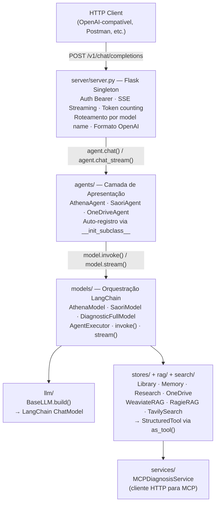
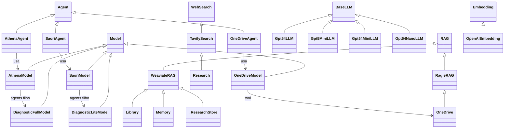
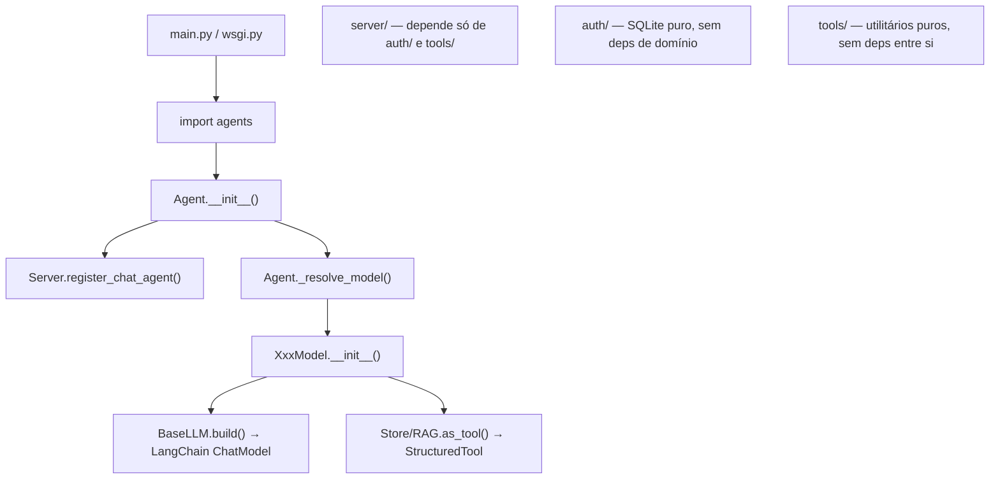
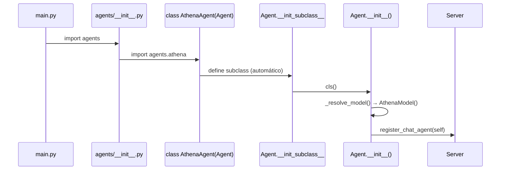

# Olympus AI Backend

Backend de agentes de IA com API compatível com OpenAI. Cada agente combina LLM + ferramentas (RAG, busca web, microserviços) e é exposto como endpoint HTTP.

---

## Índice

- [Visão Geral](#visão-geral)
- [Arquitetura](#arquitetura)
- [Mapa de Dependências](#mapa-de-dependências)
- [Camadas do Sistema](#camadas-do-sistema)
- [Variáveis de Ambiente](#variáveis-de-ambiente)
- [Execução](#execução)
- [API Reference](#api-reference)
- [Auto-Discovery](#auto-discovery)
- [Guia Rápido: Novos Componentes](#guia-rápido-novos-componentes)
- [Estrutura de Diretórios](#estrutura-de-diretórios)

---

## Visão Geral

O sistema é uma plataforma de agentes conversacionais especializados em diagnóstico de PICs (dispositivos IoT em parques). Um cliente HTTP envia mensagens no formato OpenAI e recebe respostas de agentes que raciocinam via LangChain, chamam ferramentas (MCP Diagnosis Service, busca semântica, web) e devolvem a resposta final.

**Agentes disponíveis:**

| Agente | LLM | Uso |
|--------|-----|-----|
| `Athena` | GPT-5.4 | Análises complexas, diagnósticos detalhados |
| `Saori` | GPT-5-mini | Respostas rápidas, tarefas simples |
| `OneDrive` | GPT-5-mini | Busca em documentos corporativos |

---

## Arquitetura



### Fluxo de Execução Típico

1. `POST /v1/chat/completions` chega com `Authorization: Bearer sk_xxx`
2. `Server` valida auth, extrai `model` e `messages`
3. Roteia para o `Agent` registrado com aquele nome
4. `Agent.chat()` → `Model.invoke()` → `AgentExecutor.invoke()`
5. O `AgentExecutor` decide quais tools chamar (RAG, MCP Service, etc.)
6. Consolida resposta e retorna no formato OpenAI

---

## Mapa de Dependências

### Hierarquia de Herança



### Quem depende de quem



---

## Camadas do Sistema

| Camada | Pasta | Responsabilidade |
|--------|-------|-----------------|
| HTTP / API | `server/` | Flask, auth, roteamento, SSE, formato OpenAI |
| Apresentação | `agents/` | Interface declarativa; auto-registro no servidor |
| Orquestração | `models/` | LangChain AgentExecutor; tools; invoke/stream |
| LLM | `llm/` | Declaração de modelos; REGISTRY; PassthroughProxy; Adapters |
| RAG | `rag/` + `stores/` | Busca semântica (Weaviate, Ragie); stores concretos |
| Busca Web | `search/` + `stores/` | Tavily; cache em Weaviate |
| Embeddings | `embeddings/` | OpenAI embeddings com lazy init |
| Serviços | `services/` | Clientes HTTP para microserviços externos |
| Auth | `auth/` | API keys; SQLite; CLI |
| Utilitários | `tools/` | Parsing, datas, mensagens, TOON, env |

---

## Variáveis de Ambiente

Copie `.env.example` → `.env`:

| Variável | Obrigatória | Descrição |
|----------|-------------|-----------|
| `OPENAI_API_KEY` | **Sim** | Chat + embeddings OpenAI |
| `TAVILY_API_KEY` | Não | Busca web (`Research` store) |
| `RAGIE_API_KEY` | Não | RAG gerenciado (`OneDrive` store) |
| `MCP_DIAGNOSIS_BASE_URL` | Não | URL do microserviço MCP Diagnosis |
| `MCP_DIAGNOSIS_AUTH_TOKEN` | Não | Token Bearer do microserviço MCP |
| `MCP_DIAGNOSIS_TIMEOUT_SECONDS` | Não | Timeout MCP (padrão: 300) |
| `AUTH_API_KEY` | Prod | Keys de produção, separadas por vírgula (Cloud Run) |
| `GOOGLE_API_KEY` | Não | Google Gemini |
| `ANTHROPIC_API_KEY` | Não | Anthropic Claude |
| `PORT` | Não | Porta do servidor (padrão: 6001) |
| `ENVIRONMENT` | Não | `development` ou `production` |

---

## Execução

### Desenvolvimento local

```bash
python -m venv .venv && source .venv/bin/activate
pip install -r requirements.txt
cp .env.example .env   # preencha as variáveis
python main.py
```

### Docker Compose

```bash
docker compose up --build
# Servidor em http://localhost:6001
```

### Produção (gunicorn / Cloud Run)

```bash
gunicorn wsgi:app --workers 2 --threads 4 --bind 0.0.0.0:8080
```

Ver [`docs/olympus-ai-backend/DEPLOY_GCP.md`](docs/olympus-ai-backend/DEPLOY_GCP.md) para deploy no GCP.

### Gerenciar API Keys

```bash
python auth/manage_keys.py create "nome-do-cliente" 2025-12-31
python auth/manage_keys.py list
python auth/manage_keys.py delete <id>
```

---

## API Reference

### Endpoints Públicos (sem auth)

| Método | Rota | Descrição |
|--------|------|-----------|
| `GET` | `/health` | Health check |
| `GET` | `/v1/models` | Lista agentes registrados |
| `GET` | `/models` | Idem (alias) |
| `GET` | `/passthrough` | Lista modelos passthrough (acesso direto ao provider) |

### Chat Completions (requer Bearer token)

```http
POST /v1/chat/completions
Authorization: Bearer sk_xxxxx
Content-Type: application/json
```

**Request:**
```json
{
  "model": "Athena",
  "messages": [
    { "role": "system", "content": "Contexto opcional" },
    { "role": "user",   "content": "Analise o parque X" }
  ],
  "stream": false,
  "temperature": 0.2,
  "thought_stream_mode": "content"
}
```

**Parâmetros suportados:** `temperature`, `top_p`, `max_tokens`, `frequency_penalty`, `presence_penalty`, `stop`, `seed`

**Parâmetro exclusivo `thought_stream_mode`:**

| Valor | Comportamento |
|-------|---------------|
| `content` (padrão) | Pensamentos embutidos como `<think>...</think>` no conteúdo |
| `custom` | Pensamentos em campo `"reasoning"` separado no delta de stream |
| `hidden` | Pensamentos suprimidos |

**Resposta não-streaming:**
```json
{
  "id": "chatcmpl-uuid",
  "object": "chat.completion",
  "model": "Athena",
  "choices": [{ "message": { "role": "assistant", "content": "..." }, "finish_reason": "stop" }],
  "usage": { "prompt_tokens": 100, "completion_tokens": 200, "total_tokens": 300 },
  "thought": "Passo 1\nAcao: DiagnosticFull\nObservacao: ..."
}
```

**Resposta streaming (SSE):**
```
data: {"id":"...","object":"chat.completion.chunk","choices":[{"delta":{"content":"..."},"finish_reason":null}]}
data: {"id":"...","object":"chat.completion.chunk","choices":[{"delta":{},"finish_reason":"stop"}]}
data: [DONE]
```

---

## Auto-Discovery

O sistema usa metaclasses para auto-registro sem configuração manual:



### Regras obrigatórias de nomenclatura

| Classe base | Sufixo obrigatório | Exemplo |
|-------------|-------------------|---------|
| `Agent` | `Agent` | `MeuNovoAgent` |
| `Model` | `Model` | `MeuNovoModel` |
| `BaseLLM` | — | atributos `model_name`, `provider`, `env_key` obrigatórios |

### LLMs e Passthrough

Cada `BaseLLM` com `passthrough=True` e `hide=False` é automaticamente registrado como `PassthroughProxy` no servidor. Esses agentes são invisíveis no `GET /v1/models` mas acessíveis via `POST /v1/chat/completions`.

---

## Guia Rápido: Novos Componentes

### 1. Novo LLM

```python
# llm/meu_modelo.py
from llm.llm import BaseLLM

class MeuModeloLLM(BaseLLM):
    model_name  = "gpt-5-turbo"
    provider    = "openai"         # "openai" | "google" | "anthropic"
    env_key     = "OPENAI_API_KEY"
    passthrough = True             # True → expõe endpoint direto
```

### 2. Novo Store RAG

```python
# stores/meu_store.py
from rag.weaviate import WeaviateRAG
from rag.base import TypeAccess
from embeddings.openai import OpenAIEmbedding

class MeuStore(WeaviateRAG):
    name            = "meu_store"
    description     = "Base de artigos técnicos"
    collection_name = "ZEUS_MeuStore"
    embedding       = OpenAIEmbedding("text-embedding-3-small")
    type_access     = TypeAccess.READ
```

### 3. Novo Model

Ver [`models/README.md`](models/README.md) — template completo com ferramentas, prompt e configurações.

### 4. Novo Agent

Ver [`agents/README.md`](agents/README.md) — template completo com registro e tool endpoints.

---

## Estrutura de Diretórios

| Pasta | Descrição |
|-------|-----------|
| `agents/` | Apresentação: auto-registro e interface HTTP |
| `auth/` | API keys (SQLite) + CLI de gerenciamento |
| `docs/` | Deploy GCP, Postman, documentação extra |
| `embeddings/` | Providers de embeddings |
| `llm/` | Declaração de LLMs + REGISTRY + Adapters |
| `llm/adapters/` | Adapters por provider (OpenAI, Google, Anthropic) |
| `models/` | Orquestração LangChain (AgentExecutor) |
| `rag/` | Interface RAG + implementações (Weaviate, Ragie) |
| `search/` | Interface WebSearch + Tavily |
| `server/` | Flask singleton + rotas OpenAI-compatíveis |
| `services/` | Clientes HTTP para microserviços externos |
| `stores/` | Stores concretos (combinam RAG + Search) |
| `tests/` | Testes pytest |
| `tools/` | Utilitários puros |
| `main.py` | Entry point desenvolvimento (Flask debug) |
| `wsgi.py` | Entry point produção (gunicorn) |

READMEs por pasta:

- [`agents/README.md`](agents/README.md) — como criar agentes
- [`models/README.md`](models/README.md) — como criar modelos de orquestração
- [`llm/README.md`](llm/README.md) — como adicionar novos LLMs e adapters
- [`rag/README.md`](rag/README.md) — interface RAG e backends
- [`stores/README.md`](stores/README.md) — stores concretos disponíveis
- [`search/README.md`](search/README.md) — busca web e caching
- [`embeddings/README.md`](embeddings/README.md) — providers de embedding
- [`server/README.md`](server/README.md) — servidor Flask e roteamento
- [`services/README.md`](services/README.md) — clientes de microserviços
- [`auth/README.md`](auth/README.md) — autenticação e API keys
- [`tools/README.md`](tools/README.md) — utilitários
