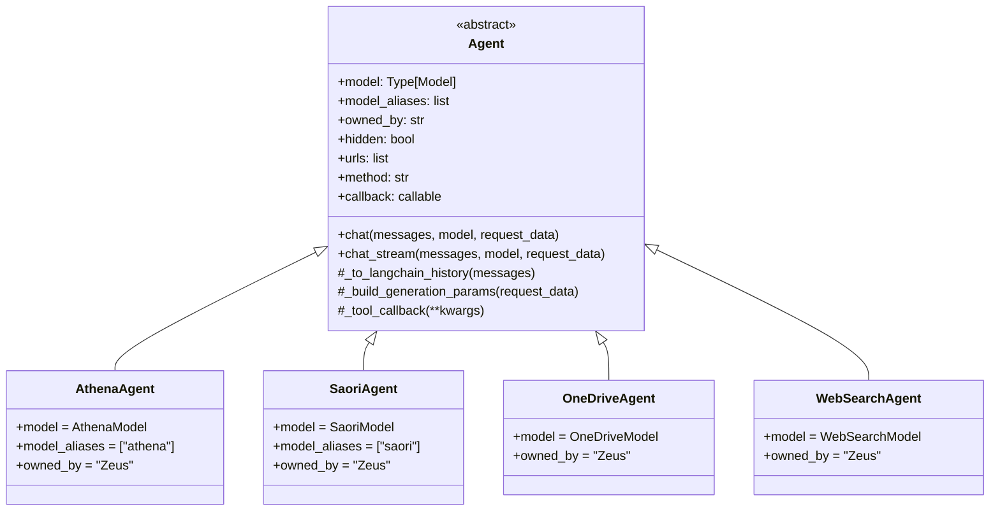
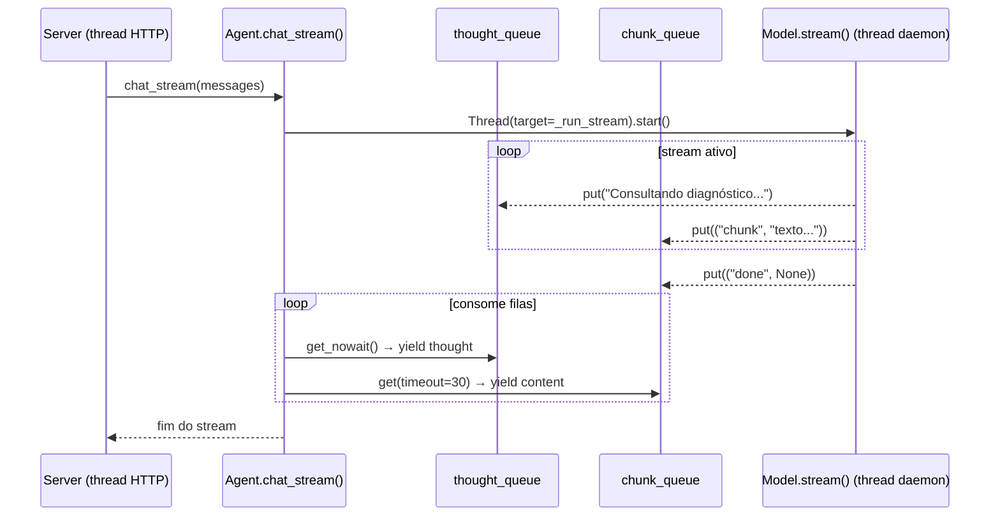

# agents/ — Camada de Apresentação

Esta camada conecta o servidor HTTP aos modelos de orquestração. Cada arquivo define um agente declarativo que se auto-registra no servidor ao ser importado.

---

## O que é um Agent

Um `Agent` é a interface pública de um modelo de IA. Ele:

1. Declara qual `Model` usa (via atributo `model`)
2. Se auto-registra no `Server` singleton ao ser instanciado
3. Implementa `chat()` e `chat_stream()` delegando para o Model
4. Opcionalmente expõe endpoints de ferramenta adicionais (`url` + `callback`)

O cliente HTTP enxerga o Agent pelo seu `name` (herdado do Model) no campo `model` da request.

---

## Classe Base: `Agent` (`agent.py`)



### Atributos declarativos

| Atributo | Tipo | Obrigatório | Descrição |
|----------|------|-------------|-----------|
| `model` | `Type[Model]` ou instância | **Sim** | Modelo de orquestração |
| `model_aliases` | `list[str]` | Não | Nomes alternativos no campo `model` da API |
| `owned_by` | `str` | Não | Organização (exibido em `GET /v1/models`) |
| `hidden` | `bool` | Não | Se `True`, não aparece em `GET /v1/models` |
| `urls` | `list[str]` | Não | Rotas de tool endpoint |
| `url` | `str` | Não | Alternativa a `urls` para rota única |
| `method` | `str` | Se tiver `urls` | Método HTTP (`"POST"`, `"GET"`, ...) |
| `callback` | `callable` | Se tiver `urls` | Função executada na rota |
| `agent_definition` | `dict` | Auto-gerado | Schema da ferramenta (nome, descrição, parâmetros) |

### Métodos principais

| Método | Descrição |
|--------|-----------|
| `chat(messages, model, request_data)` | Chat não-streaming via `model.invoke()` |
| `chat_stream(messages, model, request_data)` | Chat streaming via `model.stream()` com queues |
| `_to_langchain_history(messages)` | Converte lista OpenAI → `HumanMessage`/`AIMessage` |
| `_build_generation_params(request_data)` | Extrai `temperature`, `top_p`, `max_tokens`, etc. |
| `_tool_callback(**kwargs)` | Handler HTTP para tool endpoints |

### Mecanismo de auto-registro

```python
# Em Agent:
def __init_subclass__(cls, **kwargs):
    super().__init_subclass__(**kwargs)
    if not cls.__name__.endswith("Agent"):
        raise TypeError(...)   # nomenclatura obrigatória
    cls()                      # instancia a subclasse → dispara __init__

def __init__(self):
    self._resolve_model()      # instancia o Model declarado
    server = Server.get_instance()
    server.register_chat_agent(self)   # registra no roteador HTTP
```

---

## Agentes Disponíveis

| Agente | Arquivo | LLM | Model | Uso |
|--------|---------|-----|-------|-----|
| `AthenaAgent` | `athena.py` | GPT-5.4 | `AthenaModel` | Análises complexas, diagnósticos detalhados |
| `SaoriAgent` | `saori.py` | GPT-5-mini | `SaoriModel` | Respostas rápidas, tarefas cotidianas |
| `OneDriveAgent` | `onedrive.py` | GPT-5-nano | `OneDriveModel` | Busca em documentos corporativos |
| `WebSearchAgent` | `web_search.py` | GPT-5-nano | `WebSearchModel` | Busca de informações na web via Tavily |

---

## Como Criar um Novo Agent

### Passo a passo

1. Crie `agents/meu_agente.py`
2. Herde de `Agent`
3. Declare `model` (classe ou instância de `Model`)
4. Opcionalmente declare `model_aliases`, `owned_by`, `hidden`
5. O arquivo é importado automaticamente pelo `agents/__init__.py`

### Template: Agent simples

```python
# agents/meu_agente.py
from agents.agent import Agent
from models.meu_modelo import MeuModeloModel


class MeuAgenteAgent(Agent):
    model         = MeuModeloModel     # será instanciado automaticamente
    model_aliases = ["meu-agente", "custom"]
    owned_by      = "minha-org"
```

> O nome da classe **deve** terminar com `Agent`. O `name` do agente na API vem do `Model.name`.

### Template: Agent com tool endpoint

Use quando o agente também precisa expor uma rota HTTP independente (ex: endpoint de diagnóstico direto).

```python
# agents/meu_agente_com_rota.py
from agents.agent import Agent
from models.meu_modelo import MeuModeloModel


def _minha_funcao(param1: str, param2: int):
    """Lógica da ferramenta."""
    return {"resultado": f"{param1} x {param2}"}


class MeuAgenteComRotaAgent(Agent):
    model    = MeuModeloModel
    urls     = ["/minha-ferramenta"]
    method   = "POST"
    callback = _minha_funcao

    agent_definition = {
        "name": "minha-ferramenta",
        "description": "Executa operação customizada",
        "parameters": {
            "properties": {
                "param1": {"type": "string", "description": "Texto de entrada"},
                "param2": {"type": "integer", "description": "Multiplicador"},
            }
        },
        "returns": {"type": "object"},
    }
```

A rota `POST /minha-ferramenta` ficará disponível e retornará:
```json
{ "tool": "minha-ferramenta", "result": { "resultado": "..." }, "success": true }
```

---

## Exemplo Completo de Uso

Cenário: criar um agente **SupportAgent** que responde dúvidas técnicas usando uma base de conhecimento e também expõe um endpoint HTTP direto para consultar tickets abertos.

### 1. Criar o Model (`models/support.py`)

```python
from langchain_core.prompts import ChatPromptTemplate, MessagesPlaceholder
from langchain_core.tools import tool
from llm import LLM
from models.model import Model
from stores.library import Library


@tool
def buscar_documentacao(query: str) -> str:
    """Busca na base de documentação técnica."""
    docs = Library().search(query, k=4)
    return "\n---\n".join(d.page_content for d in docs)


class SupportModel(Model):
    name        = "Support"
    description = "Agente de suporte técnico com acesso à documentação"
    llm         = LLM("gpt-5-mini", temperature=0.1)
    tools       = [buscar_documentacao]

    thought_labels = {
        "buscar_documentacao": "Consultando documentação técnica...",
    }

    return_intermediate_steps = True

    prompt = ChatPromptTemplate.from_messages([
        ("system", """Você é um especialista em suporte técnico.
Sempre consulte a documentação antes de responder.
Seja objetivo e cite a fonte quando possível."""),
        MessagesPlaceholder("chat_history"),
        ("human", "{input}"),
        MessagesPlaceholder("agent_scratchpad"),
    ])
```

### 2. Criar o Agent (`agents/support.py`)

```python
from agents.agent import Agent
from models.support import SupportModel
from server.exceptions import ValidationError


def _consultar_tickets(client_id: str, status: str = "open"):
    """Consulta tickets abertos de um cliente."""
    if not client_id:
        raise ValidationError("client_id é obrigatório")

    # Lógica de consulta (ex: banco de dados, API externa)
    tickets = [
        {"id": "T-001", "titulo": "Erro de LoRa", "status": status, "cliente": client_id},
        {"id": "T-002", "titulo": "Bateria baixa",  "status": status, "cliente": client_id},
    ]
    return {"tickets": tickets, "total": len(tickets)}


class SupportAgent(Agent):
    model         = SupportModel
    model_aliases = ["support", "suporte"]
    owned_by      = "TechTeam"

    # Endpoint HTTP adicional: POST /tickets
    urls     = ["/tickets"]
    method   = "POST"
    callback = _consultar_tickets

    agent_definition = {
        "name": "consultar-tickets",
        "description": "Retorna tickets de suporte de um cliente",
        "parameters": {
            "properties": {
                "client_id": {"type": "string", "description": "ID do cliente"},
                "status":    {"type": "string", "description": "Status: open, closed, all"},
            }
        },
        "returns": {"type": "object"},
    }
```

### 3. Interagir via API

**Chat não-streaming:**
```bash
curl -X POST http://localhost:6001/v1/chat/completions \
  -H "Authorization: Bearer sk_xxxxx" \
  -H "Content-Type: application/json" \
  -d '{
    "model": "Support",
    "messages": [
      {"role": "user", "content": "Como faço para reiniciar um PIC remotamente?"}
    ],
    "stream": false
  }'
```

**Resposta:**
```json
{
  "id": "chatcmpl-abc123",
  "object": "chat.completion",
  "model": "Support",
  "choices": [{
    "message": {
      "role": "assistant",
      "content": "Para reiniciar um PIC remotamente, acesse o painel de controle..."
    },
    "finish_reason": "stop"
  }],
  "usage": {"prompt_tokens": 210, "completion_tokens": 85, "total_tokens": 295},
  "thought": "Ação: buscar_documentacao\nInput: reiniciar PIC remotamente\nObservação: [doc encontrado]"
}
```

**Chat streaming com thoughts:**
```bash
curl -X POST http://localhost:6001/v1/chat/completions \
  -H "Authorization: Bearer sk_xxxxx" \
  -H "Content-Type: application/json" \
  -d '{
    "model": "Support",
    "messages": [{"role": "user", "content": "Qual a diferença entre PIC-3 e PIC-4?"}],
    "stream": true,
    "thought_stream_mode": "content"
  }'
```

**Eventos SSE recebidos:**
```
data: {"choices":[{"delta":{"content":"<think>\nConsultando documentação técnica...\n</think>"}}]}
data: {"choices":[{"delta":{"content":"O PIC-3 utiliza LoRa 915 MHz enquanto o PIC-4..."}}]}
data: {"choices":[{"delta":{},"finish_reason":"stop"}]}
data: [DONE]
```

**Tool endpoint:**
```bash
curl -X POST http://localhost:6001/tickets \
  -H "Authorization: Bearer sk_xxxxx" \
  -H "Content-Type: application/json" \
  -d '{"client_id": "acme-corp", "status": "open"}'
```

**Resposta:**
```json
{
  "tool": "consultar-tickets",
  "result": {
    "tickets": [
      {"id": "T-001", "titulo": "Erro de LoRa", "status": "open", "cliente": "acme-corp"},
      {"id": "T-002", "titulo": "Bateria baixa",  "status": "open", "cliente": "acme-corp"}
    ],
    "total": 2
  },
  "success": true
}
```

**Conversa multi-turno (histórico mantido pelo cliente):**
```bash
# Turno 1
curl -X POST http://localhost:6001/v1/chat/completions \
  -H "Authorization: Bearer sk_xxxxx" \
  -H "Content-Type: application/json" \
  -d '{
    "model": "Support",
    "messages": [
      {"role": "user", "content": "Quais os requisitos de instalação do PIC-4?"}
    ]
  }'

# Turno 2 — contexto anterior incluso no payload
curl -X POST http://localhost:6001/v1/chat/completions \
  -H "Authorization: Bearer sk_xxxxx" \
  -H "Content-Type: application/json" \
  -d '{
    "model": "Support",
    "messages": [
      {"role": "user",      "content": "Quais os requisitos de instalação do PIC-4?"},
      {"role": "assistant", "content": "O PIC-4 requer alimentação de 12V..."},
      {"role": "user",      "content": "E quanto à altura mínima de instalação?"}
    ]
  }'
```

---

## `agents/__init__.py` — Auto-Discovery

```python
# agents/__init__.py
import importlib
import os

package_dir = os.path.dirname(__file__)
for filename in os.listdir(package_dir):
    if filename.endswith(".py") and filename not in ("__init__.py", "agent.py"):
        importlib.import_module(f"agents.{filename[:-3]}")
```

**Ao adicionar um novo agente**, basta criar o arquivo — o `__init__.py` o importa automaticamente, disparando o registro.

---

## Streaming e Thought Queue

O `chat_stream()` usa duas filas separadas para comunicação entre threads:



| Evento no `chunk_queue` | Ação |
|------------------------|------|
| `("chunk", text)` | `yield {"content": text}` |
| `("done", None)` | Encerra o stream |
| `("error", exc)` | Relança a exceção |
| timeout 30s | `yield {"keepalive": True}` (mantém conexão SSE) |

O servidor converte esses eventos no formato SSE de acordo com o `thought_stream_mode` configurado na request.
