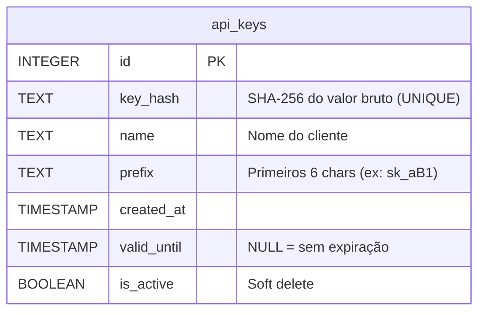
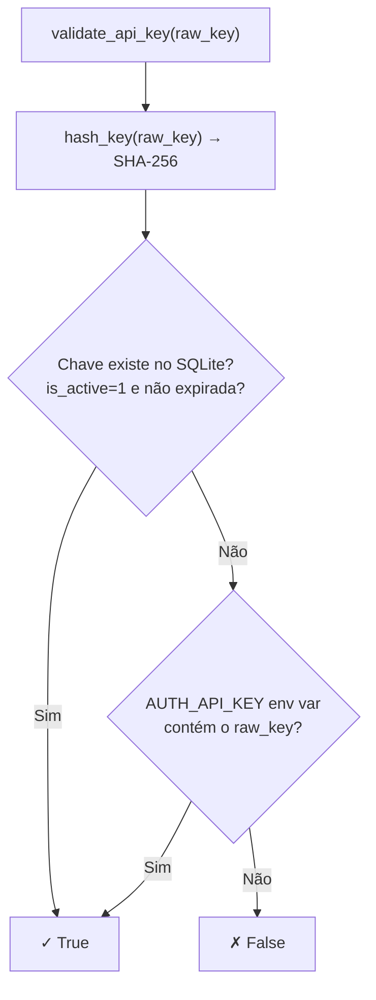

# auth/ — Autenticação e API Keys

Esta pasta gerencia autenticação da API por chaves `sk_*`, com persistência em SQLite e suporte a Cloud Run via variáveis de ambiente.

---

## Estrutura

| Arquivo | Descrição |
|---------|-----------|
| `api_keys.py` | Criação, listagem, remoção e validação de chaves |
| `manage_keys.py` | CLI de administração |
| `auth.db` | SQLite gerado na primeira execução |

---

## Schema do Banco de Dados



O valor bruto da chave **nunca é armazenado** — apenas o hash SHA-256. O valor só é exibido no momento da criação.

---

## `api_keys.py` — Funções Principais

| Função | Descrição |
|--------|-----------|
| `init_db()` | Cria a tabela `api_keys` se não existir |
| `create_api_key(name, valid_until)` | Cria chave, armazena hash, retorna valor bruto |
| `validate_api_key(raw_key)` | Valida no SQLite ou via `AUTH_API_KEY` env |
| `list_api_keys()` | Retorna todas as chaves com metadados (sem hash) |
| `delete_api_key(id)` | Remove chave por ID |
| `delete_all_api_keys()` | Remove todas as chaves |
| `generate_key()` | Gera `sk_` + 43 chars aleatórios (URL-safe) |
| `hash_key(raw_key)` | SHA-256 hexdigest |

### Fluxo de validação



---

## CLI de Gerenciamento (`manage_keys.py`)

```bash
# Criar chave sem expiração
python auth/manage_keys.py create "Nome do Cliente"

# Criar com expiração
python auth/manage_keys.py create "Nome do Cliente" 2026-12-31

# Listar
python auth/manage_keys.py list

# Deletar por ID
python auth/manage_keys.py delete 3

# Deletar todas (pede confirmação)
python auth/manage_keys.py delete-all

# Criar e armazenar no GCP Secret Manager
python auth/manage_keys.py create "Prod Client" --gcp
```

### Saída do `list`

| ID | Name | Prefix | Created | Valid Until | Active |
|----|------|--------|---------|-------------|--------|
| 1 | Prod Client | sk_aB1 | 2025-01-01 | 2026-12-31 | True |
| 2 | Dev Test | sk_xY2 | 2025-06-01 | None | True |

---

## Cloud Run (Produção)

No Cloud Run, o SQLite não é persistente entre deploys. Use a variável de ambiente `AUTH_API_KEY`:

```bash
# Uma chave
AUTH_API_KEY=sk_minhachaveprodução

# Múltiplas chaves
AUTH_API_KEY=sk_chave1,sk_chave2,sk_chave3
```

`validate_api_key()` verifica automaticamente a env var se o SQLite não tiver a chave.

---

## Formato das Chaves

| Parte | Valor |
|-------|-------|
| Prefixo | `sk_` (fixo) |
| Corpo | 43 chars aleatórios URL-safe (`secrets.token_urlsafe(32)`) |
| Total | ~46 caracteres |
| Armazenamento | SHA-256 hexdigest (64 chars) |

---

## Exemplo Completo de Uso

Cenário: ciclo completo de gerenciamento de chaves — criar chaves para diferentes clientes, integrar com o servidor, validar requisições e revogar acessos.

### 1. Gerenciamento via CLI

```bash
# --- Criar chaves ---

# Chave para cliente de produção com expiração
python auth/manage_keys.py create "Acme Corp - Prod" 2026-12-31
# Chave criada:
# ID: 1 | Nome: Acme Corp - Prod | Prefix: sk_aB1
# Valor: sk_aB1cDeFgHiJkLmNoPqRsTuVwXyZ1234567890abc  ← guardar agora!

# Chave para ambiente de desenvolvimento (sem expiração)
python auth/manage_keys.py create "Dev - Local"
# ID: 2 | Nome: Dev - Local | Prefix: sk_xY2
# Valor: sk_xY2...

# Chave para CI/CD pipeline
python auth/manage_keys.py create "CI/CD - GitHub Actions" 2025-12-31

# --- Listar chaves ativas ---
python auth/manage_keys.py list
# ID | Name                        | Prefix | Created    | Valid Until | Active
#  1 | Acme Corp - Prod            | sk_aB1 | 2025-04-09 | 2026-12-31  | True
#  2 | Dev - Local                 | sk_xY2 | 2025-04-09 | None        | True
#  3 | CI/CD - GitHub Actions      | sk_cI3 | 2025-04-09 | 2025-12-31  | True

# --- Revogar acesso ---
python auth/manage_keys.py delete 3
# Chave ID 3 removida.

# --- Para GCP (armazena no Secret Manager automaticamente) ---
python auth/manage_keys.py create "GCP Cloud Run" --gcp
# → Cria a chave e armazena o valor no Secret Manager do projeto GCP configurado
```

### 2. Uso programático completo

```python
from auth.api_keys import (
    create_api_key,
    validate_api_key,
    list_api_keys,
    delete_api_key,
    delete_all_api_keys,
    generate_key,
    hash_key,
)

# --- Criar chaves ---
raw_key_prod, id_prod = create_api_key(
    name="Acme Corp - Prod",
    valid_until="2026-12-31",
)
print(f"Prod key: {raw_key_prod}")   # EXIBIR SÓ UMA VEZ

raw_key_dev, id_dev = create_api_key(
    name="Dev - Local",
    valid_until=None,  # sem expiração
)

# --- Validar chave (ex: dentro de um middleware HTTP) ---
is_valid = validate_api_key(raw_key_prod)
print(f"Chave válida: {is_valid}")     # → True

is_valid_fake = validate_api_key("sk_chave_invalida_000")
print(f"Chave falsa:  {is_valid_fake}")  # → False

# --- Listar chaves (para auditoria) ---
chaves = list_api_keys()
for c in chaves:
    print(f"[{c['id']}] {c['name']:25s} | prefix={c['prefix']} | até={c['valid_until']} | ativo={c['is_active']}")

# --- Verificar se uma chave específica ainda existe ---
chave_existe = any(c["id"] == id_prod for c in list_api_keys())
print(f"Chave prod ainda ativa: {chave_existe}")

# --- Revogar uma chave ---
delete_api_key(id_dev)
print(f"Chave dev removida")

is_valid_revogada = validate_api_key(raw_key_dev)
print(f"Chave após revogação: {is_valid_revogada}")  # → False

# --- Gerar chave sem persistir (para testes) ---
chave_temp = generate_key()
print(f"Formato: {chave_temp[:6]}... (len={len(chave_temp)})")
# → sk_abc... (len=46)

# --- Inspecionar o hash sem criar chave ---
h = hash_key("sk_minhaChaveDeTeste")
print(f"SHA-256: {h[:16]}...")  # → "a3f8c1e2d4..."
```

### 3. Integração com o servidor (como o Server usa internamente)

```python
# Simula o middleware de autenticação do Server
from auth.api_keys import validate_api_key


def verificar_requisicao(authorization_header: str) -> bool:
    """Extrai e valida o Bearer token do header HTTP."""
    if not authorization_header:
        raise PermissionError("Missing Authorization header")

    if not authorization_header.startswith("Bearer "):
        raise PermissionError("Authorization header must use Bearer scheme")

    raw_key = authorization_header.removeprefix("Bearer ").strip()

    if not validate_api_key(raw_key):
        raise PermissionError("Invalid API Key")

    return True


# Exemplos
try:
    verificar_requisicao(f"Bearer {raw_key_prod}")
    print("✓ Requisição autorizada")
except PermissionError as e:
    print(f"✗ {e}")

try:
    verificar_requisicao("Bearer sk_invalida")
    print("✓ Autorizado")
except PermissionError as e:
    print(f"✗ {e}")
# → ✗ Invalid API Key
```

### 4. Configuração para Cloud Run (produção sem SQLite)

No Cloud Run, o sistema de arquivos é efêmero — o SQLite é recriado a cada deploy. Use `AUTH_API_KEY` para chaves permanentes:

```bash
# .env para Cloud Run (ou variável de ambiente no console GCP)
AUTH_API_KEY=sk_prodKey1xxxx,sk_prodKey2yyyy,sk_serviceAccountZzzz

# Múltiplas chaves separadas por vírgula
# validate_api_key() verifica cada uma automaticamente
```

```python
import os

# Simular o comportamento de produção
os.environ["AUTH_API_KEY"] = "sk_chave_producao_123"

from auth.api_keys import validate_api_key

# Chave vinda da env var — válida mesmo sem estar no SQLite
print(validate_api_key("sk_chave_producao_123"))  # → True
print(validate_api_key("sk_chave_outra"))         # → False
```

---

## Uso Programático

```python
from auth.api_keys import create_api_key, list_api_keys, delete_api_key, validate_api_key

# Criar
raw_key, key_id = create_api_key(name="Meu Cliente", valid_until="2026-12-31")
print(f"Chave: {raw_key}")   # exibir UMA VEZ — não é recuperável depois

# Validar
is_valid = validate_api_key(raw_key)  # → True/False

# Listar
for key in list_api_keys():
    print(key)

# Revogar
delete_api_key(key_id)
```
