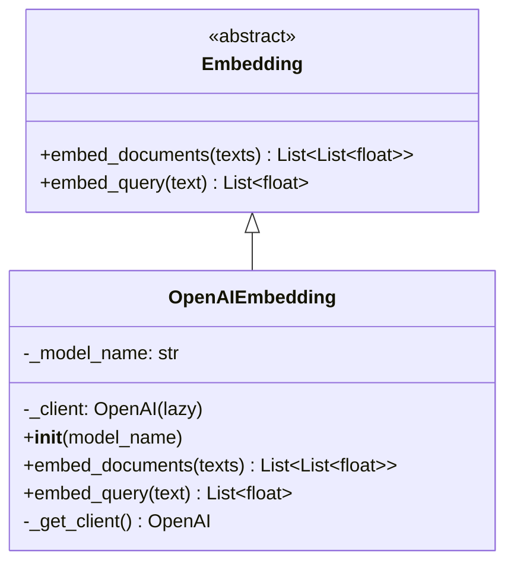

# embeddings/ — Providers de Embedding

Esta pasta define a interface abstrata de embeddings e suas implementações concretas. Embeddings são usados pelos stores RAG (Weaviate) para indexar e buscar textos semanticamente.

---

## Estrutura

| Arquivo | Descrição |
|---------|-----------|
| `base.py` | `Embedding` (ABC) — interface LangChain-compatível |
| `openai.py` | `OpenAIEmbedding` — implementação com lazy init |

---

## Hierarquia de Classes



A classe `Embedding` herda de `langchain_core.embeddings.Embeddings`, garantindo compatibilidade com o ecossistema LangChain.

---

## `OpenAIEmbedding` (`openai.py`)

### Modelos disponíveis

| Modelo | Dimensão | Qualidade | Custo relativo |
|--------|----------|-----------|---------------|
| `text-embedding-3-large` | 3072 | Máxima | Alto |
| `text-embedding-3-small` | 1536 | Alta | Baixo |
| `text-embedding-ada-002` | 1536 | Boa (legado) | Médio |

### Lazy Initialization

O cliente OpenAI é criado na **primeira chamada** para `embed_query()` ou `embed_documents()`, não no `__init__`. Isso evita erros de import quando `OPENAI_API_KEY` não está disponível em tempo de carga do módulo.

```python
# Seguro — não cria cliente ainda
embedding = OpenAIEmbedding("text-embedding-3-large")

# Cria o cliente apenas aqui
vector = embedding.embed_query("Como funciona o sistema de LoRa?")
```

### Uso

```python
from embeddings.openai import OpenAIEmbedding

embedding = OpenAIEmbedding("text-embedding-3-large")

# Query única
vector = embedding.embed_query("texto de busca")
# → [0.023, -0.045, ...]  (List[float])

# Múltiplos documentos
vectors = embedding.embed_documents(["Texto 1", "Texto 2"])
# → [[...], [...]]  (List[List[float]])
```

---

## Uso nos Stores

Os stores declaram o embedding como atributo de classe:

```python
# stores/library.py
from embeddings.openai import OpenAIEmbedding
from rag.weaviate import WeaviateRAG

class Library(WeaviateRAG):
    embedding = OpenAIEmbedding("text-embedding-3-large")
    # ...
```

O `WeaviateRAG` usa o embedding para:
- `write()` — converter textos em vetores antes de indexar
- `search()` — converter a query em vetor antes de buscar

---

## Exemplo Completo de Uso

Cenário: comparar dois modelos de embedding para decidir qual usar, indexar documentos num store Weaviate e fazer buscas semânticas.

### 1. Usar os embeddings diretamente

```python
from embeddings.openai import OpenAIEmbedding

# --- text-embedding-3-large (máxima qualidade, dim=3072) ---
emb_large = OpenAIEmbedding("text-embedding-3-large")

# Query single
vetor = emb_large.embed_query("Como funciona o protocolo LoRaWAN?")
print(f"Dimensão: {len(vetor)}")          # → 3072
print(f"Primeiros 5: {vetor[:5]}")        # → [-0.021, 0.045, ...]

# Múltiplos documentos
textos = [
    "LoRaWAN usa OTAA para ativação over-the-air dos dispositivos.",
    "ABP (Activation By Personalization) pré-configura as chaves de sessão.",
    "O gateway LoRa encaminha os pacotes para o network server.",
]
vetores = emb_large.embed_documents(textos)
print(f"Documentos embedados: {len(vetores)}")     # → 3
print(f"Dimensão por vetor:   {len(vetores[0])}")  # → 3072

# --- text-embedding-3-small (alta qualidade, dim=1536, mais barato) ---
emb_small = OpenAIEmbedding("text-embedding-3-small")

vetor_small = emb_small.embed_query("diagnóstico de bateria")
print(f"Dimensão small: {len(vetor_small)}")  # → 1536

# --- Comparar similaridade (produto interno / cosine similarity) ---
import math

def cosine_similarity(a, b):
    dot    = sum(x * y for x, y in zip(a, b))
    norm_a = math.sqrt(sum(x**2 for x in a))
    norm_b = math.sqrt(sum(x**2 for x in b))
    return dot / (norm_a * norm_b)

query_vetor  = emb_small.embed_query("ativação LoRaWAN")
doc_vetores  = emb_small.embed_documents([
    "OTAA realiza ativação dinâmica de dispositivos LoRaWAN",
    "A bateria do PIC-4 dura 18 meses em operação normal",
    "ABP configura chaves de sessão estaticamente",
])

scores = [cosine_similarity(query_vetor, dv) for dv in doc_vetores]
for i, (texto, score) in enumerate(zip(textos, scores)):
    print(f"[{score:.3f}] {texto[:60]}")
# → [0.891] OTAA realiza ativação dinâmica...
# → [0.312] A bateria do PIC-4 dura 18 meses...
# → [0.724] ABP configura chaves de sessão...
```

### 2. Usar num Store Weaviate (forma padrão do sistema)

```python
from embeddings.openai import OpenAIEmbedding
from rag.base import TypeAccess
from rag.weaviate import WeaviateRAG


class TelemetriaStore(WeaviateRAG):
    """Documentação técnica sobre telemetria e protocolos de comunicação."""
    description       = "Base de conhecimento sobre telemetria IoT"
    collection_name   = "ZEUS_Telemetria"
    embedding         = OpenAIEmbedding("text-embedding-3-large")
    type_access       = TypeAccess.ALL
    max_query_results = 5
    metadata_fields   = ["protocolo", "versao", "topico"]


store = TelemetriaStore()

# Indexar documentos — o embedding é chamado internamente no write()
store.write(
    texts=[
        "LoRaWAN Class A: dispositivos iniciam comunicação (uplink), servidor responde em janelas RX1/RX2.",
        "LoRaWAN Class C: receptor sempre aberto, latência mínima, maior consumo de energia.",
        "Spreading Factor (SF): valores de SF7 a SF12 controlam alcance vs. data rate.",
    ],
    metadatas=[
        {"protocolo": "LoRaWAN", "versao": "1.0.4", "topico": "classes"},
        {"protocolo": "LoRaWAN", "versao": "1.0.4", "topico": "classes"},
        {"protocolo": "LoRaWAN", "versao": "1.0.4", "topico": "radio"},
    ],
)

# Buscar — o embedding converte a query automaticamente antes de buscar
docs = store.search("consumo de energia dispositivos LoRa", k=3)
for doc in docs:
    print(f"[{doc.metadata.get('topico')}] {doc.page_content[:100]}")
```

### 3. Escolher o modelo de embedding correto

```python
from embeddings.openai import OpenAIEmbedding

# Comparativo prático
modelos = {
    "text-embedding-3-large": {
        "embedding": OpenAIEmbedding("text-embedding-3-large"),
        "uso": "Library (documentação crítica, buscas semânticas profundas)",
        "custo": "~$0.13 / 1M tokens",
    },
    "text-embedding-3-small": {
        "embedding": OpenAIEmbedding("text-embedding-3-small"),
        "uso": "Memory, Research cache, stores de alto volume",
        "custo": "~$0.02 / 1M tokens",
    },
}

query = "diagnóstico de rede LoRa em parque fotovoltaico"

for nome, info in modelos.items():
    vetor = info["embedding"].embed_query(query)
    print(f"\n{nome}")
    print(f"  Dimensão: {len(vetor)}")
    print(f"  Uso recomendado: {info['uso']}")
    print(f"  Custo: {info['custo']}")
```

### 4. Compatibilidade LangChain

O `OpenAIEmbedding` é compatível com qualquer componente LangChain que aceite `langchain_core.embeddings.Embeddings`:

```python
from embeddings.openai import OpenAIEmbedding
from langchain_community.vectorstores import FAISS

embedding = OpenAIEmbedding("text-embedding-3-small")

# Usar com FAISS (exemplo de integração LangChain)
vectorstore = FAISS.from_texts(
    texts=["texto 1", "texto 2", "texto 3"],
    embedding=embedding,
)
resultado = vectorstore.similarity_search("busca semântica", k=2)
```

---

## Como Adicionar um Novo Provider

```python
# embeddings/meu_provider.py
import os
from typing import List
from embeddings.base import Embedding


class MeuProviderEmbedding(Embedding):

    def __init__(self, model_name: str = "meu-modelo-default"):
        self._model_name = model_name
        self._client = None  # lazy init

    def _get_client(self):
        if self._client is None:
            from meu_provider_sdk import EmbeddingClient
            self._client = EmbeddingClient(api_key=os.getenv("MEU_PROVIDER_API_KEY"))
        return self._client

    def embed_documents(self, texts: List[str]) -> List[List[float]]:
        client = self._get_client()
        return [client.embed(t, model=self._model_name) for t in texts]

    def embed_query(self, text: str) -> List[float]:
        return self.embed_documents([text])[0]
```

Para usar num Store:

```python
from embeddings.meu_provider import MeuProviderEmbedding
from rag.weaviate import WeaviateRAG

class MeuStore(WeaviateRAG):
    embedding = MeuProviderEmbedding("meu-modelo")
```
