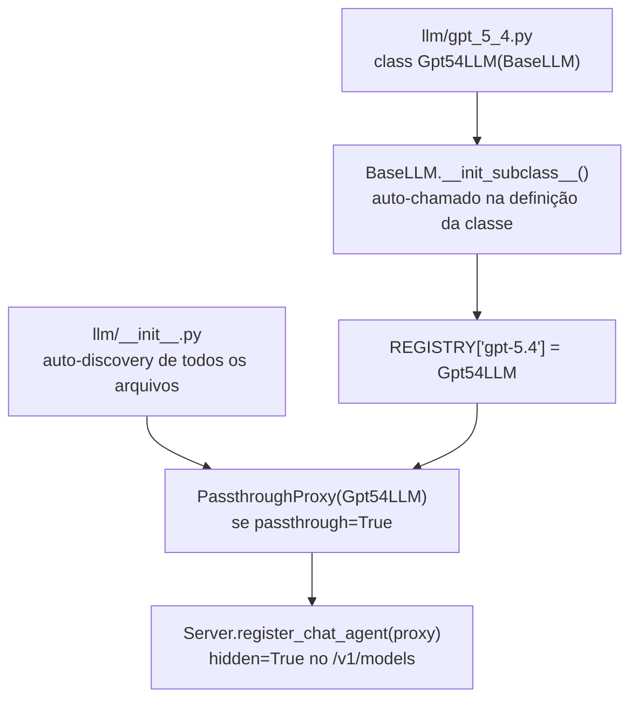
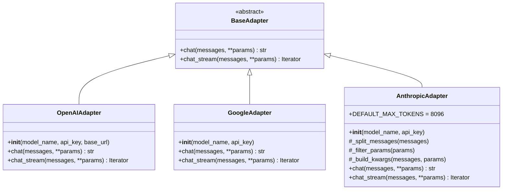

# llm/ — Declaração de LLMs e Adapters

Esta pasta gerencia todos os modelos de linguagem disponíveis: declaração, registro, instanciação para LangChain e acesso direto (passthrough) via SDK do provider.

---

## Estrutura

| Arquivo | Descrição |
|---------|-----------|
| `llm.py` | `BaseLLM`, `REGISTRY` global, `PassthroughProxy` |
| `__init__.py` | Auto-discovery + `LLM()` factory + registro de passthroughs no servidor |
| `gpt_5_4.py` | `Gpt54LLM` — declara `gpt-5.4` |
| `gpt_5_mini.py` | `Gpt5MiniLLM` — declara `gpt-5-mini` |
| `gpt_5_4_mini.py` | `Gpt54MiniLLM` — declara `gpt-5.4-mini` |
| `gpt_5_4_nano.py` | `Gpt54NanoLLM` — declara `gpt-5.4-nano` |
| `adapters/__init__.py` | `BaseAdapter`, `ADAPTER_REGISTRY`, `build_adapter()`, auto-discovery |
| `adapters/openai.py` | `OpenAIAdapter` |
| `adapters/google.py` | `GoogleAdapter` (OpenAI-compatible endpoint) |
| `adapters/anthropic.py` | `AnthropicAdapter` (Anthropic SDK) |

---

## Conceitos Fundamentais

### Dois modos de uso de LLM

| Modo | Classe | Quando usar |
|------|--------|-------------|
| **LangChain** | `BaseLLM.build()` → `BaseChatModel` | Dentro de Models (AgentExecutor) |
| **Passthrough** | `PassthroughProxy` → `Adapter` | Acesso direto ao provider, sem LangChain |

### Fluxo de registro



---

## `BaseLLM` (`llm.py`)

Classe base declarativa. Subclasses representam modelos disponíveis.

### Atributos obrigatórios

| Atributo | Tipo | Descrição |
|----------|------|-----------|
| `model_name` | `str` | Nome exato do modelo no provider |
| `provider` | `str` | `"openai"` \| `"google"` \| `"anthropic"` |
| `env_key` | `str` | Variável de ambiente com a API key |

### Atributos opcionais

| Atributo | Tipo | Padrão | Descrição |
|----------|------|--------|-----------|
| `passthrough` | `bool` | `False` | Se `True`, cria endpoint direto `/v1/chat/completions` |
| `hide` | `bool` | `False` | Se `True`, bloqueia o registro passthrough |

### `BaseLLM.build(**kwargs) → BaseChatModel`

Instancia o LangChain ChatModel correspondente ao provider:

| `provider` | Classe LangChain |
|------------|-----------------|
| `"openai"` | `ChatOpenAI` |
| `"google"` | `ChatGoogleGenerativeAI` |
| `"anthropic"` | `ChatAnthropic` |

---

## Modelos Disponíveis

| Arquivo | Classe | `model_name` | `provider` | `passthrough` |
|---------|--------|--------------|------------|---------------|
| `gpt_5_4.py` | `Gpt54LLM` | `gpt-5.4` | `openai` | `True` |
| `gpt_5_mini.py` | `Gpt5MiniLLM` | `gpt-5-mini` | `openai` | `True` |
| `gpt_5_4_mini.py` | `Gpt54MiniLLM` | `gpt-5.4-mini` | `openai` | `True` |
| `gpt_5_4_nano.py` | `Gpt54NanoLLM` | `gpt-5.4-nano` | `openai` | `True` |

---

## `PassthroughProxy` (`llm.py`)

Proxy que delega diretamente ao SDK do provider (sem LangChain). Criado automaticamente pelo `llm/__init__.py` para cada `BaseLLM` com `passthrough=True`.

### Parâmetros suportados

`temperature`, `top_p`, `max_tokens`, `frequency_penalty`, `presence_penalty`, `stop`, `seed`, `logprobs`, `top_logprobs`, `n`, `user`

O `PassthroughProxy` é registrado no `Server` como `hidden=True` — aparece em `GET /passthrough` mas não em `GET /v1/models`.

---

## `adapters/` — Adapters de Provider



### Particularidades por adapter

| Adapter | Provider | Notas |
|---------|----------|-------|
| `OpenAIAdapter` | OpenAI SDK | Suporta `base_url` para endpoints compatíveis |
| `GoogleAdapter` | OpenAI SDK → Google endpoint | Gemini via interface OpenAI-compatible |
| `AnthropicAdapter` | Anthropic SDK | Filtra `frequency_penalty`, `presence_penalty`, etc. (não suportados); `system` é parâmetro separado; `max_tokens` obrigatório (default 8096) |

### Factory de adapters

```python
from llm.adapters import build_adapter

adapter = build_adapter(model_name="gpt-5.4", provider="openai", api_key="sk-...")
text = adapter.chat(messages=[...], temperature=0.2)
```

---

## `LLM()` — Factory Function

Exportada por `llm/__init__.py`, é a forma canônica de instanciar LangChain models nos Models:

```python
from llm import LLM

llm = LLM("gpt-5.4", temperature=0.2, max_tokens=4096)
# → Gpt54LLM.build(temperature=0.2, max_tokens=4096)
# → ChatOpenAI(model_name="gpt-5.4", ...)
```

---

## Exemplo Completo de Uso

Cenário: registrar um novo modelo Gemini, usá-lo em um Model via factory `LLM()`, acessá-lo em modo passthrough e chamar o adapter diretamente.

### 1. Declarar o novo LLM (`llm/gemini_2_flash.py`)

```python
from llm.llm import BaseLLM


class Gemini2FlashLLM(BaseLLM):
    model_name  = "gemini-2.0-flash"
    provider    = "google"
    env_key     = "GOOGLE_API_KEY"
    passthrough = True   # cria endpoint /v1/chat/completions automático
    hide        = False  # visível em GET /passthrough
```

Após salvar o arquivo, ao iniciar o servidor o auto-discovery registra o modelo e cria o `PassthroughProxy`.

### 2. Usar no Model via `LLM()` factory

```python
# models/meu_modelo.py
from langchain_core.prompts import ChatPromptTemplate, MessagesPlaceholder
from llm import LLM
from models.model import Model


class MeuModel(Model):
    name  = "MeuAgente"
    description = "Agente usando Gemini 2.0 Flash"
    llm   = LLM("gemini-2.0-flash", temperature=0.3, max_tokens=2048)
    # ↑ equivale a: Gemini2FlashLLM.build(temperature=0.3, max_tokens=2048)
    #               → ChatGoogleGenerativeAI(model="gemini-2.0-flash", ...)

    prompt = ChatPromptTemplate.from_messages([
        ("system", "Você é um assistente útil."),
        MessagesPlaceholder("chat_history"),
        ("human", "{input}"),
        MessagesPlaceholder("agent_scratchpad"),
    ])
```

### 3. Acessar via passthrough (requisição direta ao provider)

O passthrough encaminha a requisição diretamente ao Google sem usar LangChain:

```bash
# Listar modelos passthrough disponíveis
curl http://localhost:6001/passthrough
# → [{"id": "gemini-2.0-flash", "owned_by": "google"}, ...]

# Usar o modelo diretamente
curl -X POST http://localhost:6001/v1/chat/completions \
  -H "Authorization: Bearer sk_xxxxx" \
  -H "Content-Type: application/json" \
  -d '{
    "model": "gemini-2.0-flash",
    "messages": [{"role": "user", "content": "Explique LoRa em 2 frases"}],
    "temperature": 0.5,
    "max_tokens": 200
  }'
```

### 4. Usar o adapter diretamente (sem LangChain, sem servidor)

```python
from llm.adapters import build_adapter

# OpenAI
openai_adapter = build_adapter(
    model_name="gpt-5-mini",
    provider="openai",
    api_key="sk-...",
)

resposta = openai_adapter.chat(
    messages=[
        {"role": "system", "content": "Você é um assistente técnico."},
        {"role": "user",   "content": "O que é OTAA no LoRaWAN?"},
    ],
    temperature=0.2,
    max_tokens=300,
)
print(resposta)  # → "OTAA (Over-The-Air Activation) é..."

# Streaming com OpenAI
for chunk in openai_adapter.chat_stream(
    messages=[{"role": "user", "content": "Liste 3 vantagens do LoRa"}],
    temperature=0.3,
):
    print(chunk, end="", flush=True)

# Google (Gemini via interface OpenAI-compatible)
google_adapter = build_adapter(
    model_name="gemini-2.0-flash",
    provider="google",
    api_key="AIza...",
)
resposta_google = google_adapter.chat(
    messages=[{"role": "user", "content": "Resuma LoRa em uma frase"}],
    temperature=0.1,
)

# Anthropic (Anthropic SDK — parâmetros diferentes)
anthropic_adapter = build_adapter(
    model_name="claude-sonnet-4-6",
    provider="anthropic",
    api_key="sk-ant-...",
)
resposta_anthropic = anthropic_adapter.chat(
    messages=[
        {"role": "system",  "content": "Você é um especialista em IoT."},
        {"role": "user",    "content": "Diferença entre LoRa e Sigfox"},
    ],
    temperature=0.2,
    # max_tokens não informado → usa DEFAULT_MAX_TOKENS = 8096
    # frequency_penalty e presence_penalty são filtrados automaticamente
)
```

### 5. Inspecionar o REGISTRY

```python
from llm.llm import REGISTRY

# Ver todos os modelos registrados
for nome, cls in REGISTRY.items():
    print(f"{nome} → {cls.__name__} ({cls.provider})")

# gpt-5.4           → Gpt54LLM (openai)
# gpt-5-mini        → Gpt5MiniLLM (openai)
# gpt-5.4-mini      → Gpt54MiniLLM (openai)
# gpt-5.4-nano      → Gpt54NanoLLM (openai)
# gemini-2.0-flash  → Gemini2FlashLLM (google)

# Construir uma instância LangChain manualmente
llm_cls = REGISTRY["gpt-5.4"]
chat_model = llm_cls.build(temperature=0.0, max_tokens=1024)
# → ChatOpenAI(model_name="gpt-5.4", temperature=0.0, max_tokens=1024)

# Invocar diretamente (sem AgentExecutor)
from langchain_core.messages import HumanMessage
resposta = chat_model.invoke([HumanMessage(content="Olá!")])
print(resposta.content)
```

---

## Como Adicionar um Novo LLM

```python
# llm/gemini_2_flash.py
from llm.llm import BaseLLM

class Gemini2FlashLLM(BaseLLM):
    model_name  = "gemini-2.0-flash"
    provider    = "google"
    env_key     = "GOOGLE_API_KEY"
    passthrough = True
```

Isso é tudo. O auto-discovery importa o arquivo, `__init_subclass__` registra no `REGISTRY`, e o `__init__.py` cria e registra o `PassthroughProxy` no servidor.

Para usar em um Model:

```python
from llm import LLM

class MeuModel(Model):
    llm = LLM("gemini-2.0-flash", temperature=0.3)
```

---

## Como Adicionar um Novo Provider (Adapter)

```python
# llm/adapters/meu_provider.py
from typing import Any, Dict, Iterator, List
from llm.adapters import BaseAdapter, register_adapter


@register_adapter("meu-provider")
class MeuProviderAdapter(BaseAdapter):

    def __init__(self, model_name: str, api_key: str) -> None:
        from meu_provider_sdk import Client
        self._model = model_name
        self._client = Client(api_key=api_key)

    def chat(self, messages: List[Dict[str, Any]], **params: Any) -> str:
        response = self._client.complete(model=self._model, messages=messages, **params)
        return response.text

    def chat_stream(self, messages: List[Dict[str, Any]], **params: Any) -> Iterator[str]:
        for chunk in self._client.stream(model=self._model, messages=messages, **params):
            yield chunk.text
```

O arquivo é auto-descoberto pelo `adapters/__init__.py`. Basta declarar `provider = "meu-provider"` em um `BaseLLM`.
