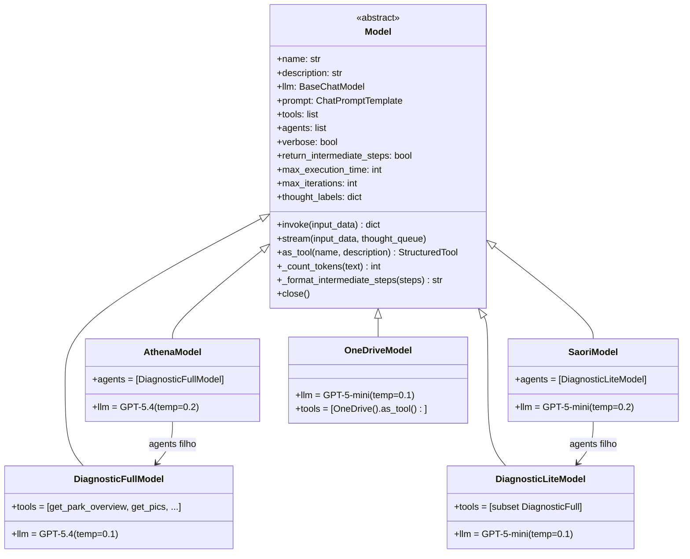
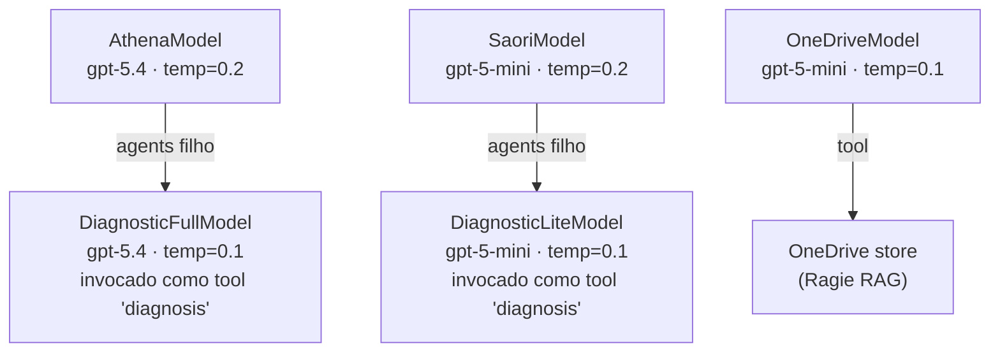

# models/ — Camada de Orquestração

Esta camada define como cada agente pensa: qual LLM usa, quais ferramentas pode chamar e como orquestra execuções via LangChain `AgentExecutor`.

---

## O que é um Model

Um `Model` é o cérebro de um `Agent`. Ele:

1. Declara `llm`, `prompt`, `tools` e `agents` filhos
2. Cria um `AgentExecutor` do LangChain no `__init__`
3. Expõe `invoke()` (síncrono) e `stream()` (gerador)
4. Pode ser usado como ferramenta de outro Model via `as_tool()`

---

## Classe Base: `Model` (`model.py`)



### Atributos declarativos

| Atributo | Tipo | Obrigatório | Descrição |
|----------|------|-------------|-----------|
| `name` | `str` | **Sim** | Nome do agente na API |
| `description` | `str` | **Sim** | Descrição (usada em `as_tool()`) |
| `llm` | `BaseChatModel` | **Sim** | LangChain ChatModel (via `LLM()` factory) |
| `prompt` | `ChatPromptTemplate` | **Sim** | Prompt com placeholders obrigatórios |
| `tools` | `list[StructuredTool]` | Não | Ferramentas diretas (`@tool` functions ou `.as_tool()`) |
| `agents` | `list[Type[Model]]` | Não | Modelos filhos — convertidos em tools automaticamente |
| `verbose` | `bool` | Não | LangChain verbose (padrão: `False`) |
| `return_intermediate_steps` | `bool` | Não | Retorna passos intermediários (padrão: `False`) |
| `max_execution_time` | `int` | Não | Timeout do executor em segundos (padrão: 600) |
| `max_iterations` | `int` | Não | Máx. iterações do AgentExecutor (padrão: 15) |
| `thought_labels` | `dict[str, str]` | Não | Labels exibidos no thought stream por nome de tool |

### Placeholders obrigatórios no prompt

```python
ChatPromptTemplate.from_messages([
    ("system", "..."),
    MessagesPlaceholder("chat_history"),      # ← obrigatório
    ("human", "{input}"),                     # ← obrigatório
    MessagesPlaceholder("agent_scratchpad"),  # ← obrigatório (LangChain interno)
])
```

### Métodos principais

| Método | Retorno | Descrição |
|--------|---------|-----------|
| `invoke(input_data)` | `{"output": str, "thought": str}` | Execução síncrona via AgentExecutor |
| `stream(input_data, thought_queue)` | gerador de chunks | Execução streaming; pensamentos → `thought_queue` |
| `as_tool(name, description)` | `StructuredTool` | Expõe o model como ferramenta de outro model |
| `_count_tokens(text)` | `int` | Conta tokens via tiktoken |
| `_format_intermediate_steps(steps)` | `str` | Formata passos intermediários em texto legível |
| `close()` | — | Fecha conexões de agents filhos instanciados |

---

## Modelos Disponíveis

### Hierarquia de delegação



### `AthenaModel` (`athena.py`)

| Atributo | Valor |
|----------|-------|
| LLM | `gpt-5.4`, temperature=0.2 |
| `agents` | `[DiagnosticFullModel]` |
| `return_intermediate_steps` | `True` |
| `thought_labels` | `{"diagnosis": "Realizando diagnóstico completo..."}` |

Planner estratégico: analisa intent, delega diagnósticos e sintetiza resultados.

### `SaoriModel` (`saori.py`)

| Atributo | Valor |
|----------|-------|
| LLM | `gpt-5-mini`, temperature=0.2 |
| `agents` | `[DiagnosticLiteModel]` |
| `return_intermediate_steps` | `True` |

Versão ágil: mesma lógica com LLM menor e prompts mais concisos.

### `DiagnosticFullModel` (`diagnostic_full.py`)

| Atributo | Valor |
|----------|-------|
| LLM | `gpt-5.4`, temperature=0.1 |
| Execução paralela | `ThreadPoolExecutor` |

Ferramentas disponíveis (`@tool` functions):

| Tool | Paralelo | Descrição |
|------|----------|-----------|
| `get_park_overview` | Sim | Métricas globais + PICs offline/standby |
| `get_pics` | Não | Lista PICs com filtros (cliente, status, hardware, modelo) |
| `run_complete_diagnosis` | Sim | LoRa + WiFi + battery + solar em paralelo |
| `make_grafana_link` | Não | Gera link do dashboard Grafana com filtros dinâmicos |

### `DiagnosticLiteModel` (`diagnostic_lite.py`)

| Atributo | Valor |
|----------|-------|
| LLM | `gpt-5-mini`, temperature=0.1 |

Reutiliza as `@tool` functions do `DiagnosticFullModel` — mesma API, LLM mais leve.

### `OneDriveModel` (`onedrive.py`)

| Atributo | Valor |
|----------|-------|
| LLM | `gpt-5-nano`, temperature=0.1 |
| `tools` | `[OneDrive().as_tool()]` |

Agente de consulta documental especializado nos arquivos do OneDrive. Segue um protocolo rígido de resposta:

1. **Sempre consulta o OneDrive** antes de formular qualquer resposta.
2. **Se não encontrar** informação relevante, responde somente: _"O assunto não consta na base de documentos."_
3. **Se encontrar**, gera uma resposta em markdown com:
   - Citações inline pelo número da fonte: `[1]`, `[2]`
   - Seção `## Fontes` ao final com tabela `# | Documento | Localização | Link`
4. **Localização** na tabela varia por tipo de arquivo:
   - `.pdf` / `.pptx` → `p. X` ou `p. X-Y` (via `start_page`/`end_page`)
   - vídeo/áudio → `Xmin Ys` (via `start_time`/`end_time`)
   - outros (`.md`, `.xlsx`, etc.) → `—`
5. **Nunca** repete o mesmo documento na tabela — agrupa por `document_name`.

---

## Thought Queue e Streaming

O streaming usa `threading.local` para propagar o `thought_queue` para modelos aninhados:

```python
# Em Model.stream():
_thought_queue_local.queue = thought_queue   # disponível globalmente na thread

# Em Model.invoke() (quando chamado de dentro de stream):
tq = getattr(_thought_queue_local, "queue", None)
if tq:
    config = {"callbacks": [_ThoughtQueueCallback(thought_labels, tq)]}
    self.agent_executor.invoke(input_data, config)
```

`_ThoughtQueueCallback` intercepta `on_agent_action` e envia labels para a fila, permitindo que o servidor emita pensamentos em tempo real no SSE.

---

## Como Criar um Novo Model

### Passo a passo

1. Crie `models/meu_modelo.py`
2. Herde de `Model`
3. Declare `name`, `description`, `llm`, `prompt`
4. Declare `tools` e/ou `agents` conforme necessário
5. Associe a um `Agent` em `agents/`

### Template básico (sem tools)

```python
# models/meu_modelo.py
from langchain_core.prompts import ChatPromptTemplate, MessagesPlaceholder
from llm import LLM
from models.model import Model


class MeuModeloModel(Model):
    name        = "MeuModelo"
    description = "Agente especialista em consultas de estoque"
    llm         = LLM("gpt-5-mini", temperature=0.2)

    prompt = ChatPromptTemplate.from_messages([
        ("system", """Você é um especialista em gestão de estoque.
Responda de forma direta e objetiva."""),
        MessagesPlaceholder("chat_history"),
        ("human", "{input}"),
        MessagesPlaceholder("agent_scratchpad"),
    ])
```

### Template com ferramentas RAG e WebSearch

```python
# models/meu_modelo.py
from langchain_core.prompts import ChatPromptTemplate, MessagesPlaceholder
from langchain_core.tools import tool
from llm import LLM
from models.model import Model
from stores.library import Library
from stores.research import Research


@tool
def buscar_produto(nome: str) -> str:
    """Busca um produto pelo nome no catálogo."""
    resultado = Library().search(nome, k=3)
    return "\n".join([d.page_content for d in resultado])


class MeuModeloModel(Model):
    name        = "MeuModelo"
    description = "Agente de estoque com busca em catálogo e web"
    llm         = LLM("gpt-5.4", temperature=0.1)
    tools       = [buscar_produto, *Research().as_tool()]

    thought_labels = {
        "buscar_produto":       "Consultando catálogo de produtos...",
        "Research_WebSearch":   "Pesquisando na internet...",
    }

    verbose                   = True
    return_intermediate_steps = True

    prompt = ChatPromptTemplate.from_messages([
        ("system", "Você é especialista em estoque. Use as ferramentas disponíveis."),
        MessagesPlaceholder("chat_history"),
        ("human", "{input}"),
        MessagesPlaceholder("agent_scratchpad"),
    ])
```

### Template com Model filho (agente aninhado)

```python
# models/orquestrador.py
from langchain_core.prompts import ChatPromptTemplate, MessagesPlaceholder
from llm import LLM
from models.model import Model
from models.meu_modelo import MeuModeloModel


class OrquestradorModel(Model):
    name        = "Orquestrador"
    description = "Planner que delega para especialistas"
    llm         = LLM("gpt-5.4", temperature=0.2)
    agents      = [MeuModeloModel]   # .as_tool() é chamado automaticamente

    thought_labels = {
        "MeuModelo": "Consultando especialista de estoque..."
    }

    prompt = ChatPromptTemplate.from_messages([
        ("system", "Você é um orquestrador. Delegue tarefas para os especialistas."),
        MessagesPlaceholder("chat_history"),
        ("human", "{input}"),
        MessagesPlaceholder("agent_scratchpad"),
    ])
```

---

## Exemplo Completo de Uso

Cenário: **InventoryModel** — agente de consultas de estoque que usa RAG na biblioteca técnica, busca web com cache e delega análises profundas para um subagente especializado.

### 1. Subagente especializado (`models/inventory_analyzer.py`)

```python
from langchain_core.prompts import ChatPromptTemplate, MessagesPlaceholder
from langchain_core.tools import tool
from llm import LLM
from models.model import Model
from stores.library import Library


@tool
def buscar_catalogo(produto: str) -> str:
    """Busca especificações técnicas de um produto no catálogo."""
    docs = Library().search(f"especificações {produto}", k=3)
    return "\n---\n".join(d.page_content for d in docs)


@tool
def calcular_estoque_minimo(produto: str, demanda_diaria: int, lead_time_dias: int) -> str:
    """Calcula o estoque mínimo de segurança para um produto."""
    estoque_minimo = demanda_diaria * lead_time_dias * 1.2
    return f"Estoque mínimo para {produto}: {int(estoque_minimo)} unidades"


class InventoryAnalyzerModel(Model):
    name        = "InventoryAnalyzer"
    description = "Analisa estoque e calcula métricas de reposição"
    llm         = LLM("gpt-5.4", temperature=0.1)
    tools       = [buscar_catalogo, calcular_estoque_minimo]

    thought_labels = {
        "buscar_catalogo":          "Consultando catálogo técnico...",
        "calcular_estoque_minimo":  "Calculando métricas de estoque...",
    }

    max_iterations = 8

    prompt = ChatPromptTemplate.from_messages([
        ("system", """Você é um especialista em gestão de estoque.
Analise os dados fornecidos, consulte o catálogo e calcule métricas precisas.
Apresente resultados em formato estruturado."""),
        MessagesPlaceholder("chat_history"),
        ("human", "{input}"),
        MessagesPlaceholder("agent_scratchpad"),
    ])
```

### 2. Model orquestrador com busca web (`models/inventory.py`)

```python
from langchain_core.prompts import ChatPromptTemplate, MessagesPlaceholder
from llm import LLM
from models.model import Model
from models.inventory_analyzer import InventoryAnalyzerModel
from stores.research import Research


class InventoryModel(Model):
    name        = "Inventory"
    description = "Orquestrador de consultas de estoque com análise profunda e pesquisa web"
    llm         = LLM("gpt-5.4", temperature=0.2)

    # Subagente como ferramenta — invocado automaticamente via as_tool()
    agents = [InventoryAnalyzerModel]

    # Busca web com cache (gera 2 tools: Research_WebSearch + Research_ReadCache)
    tools  = [*Research().as_tool()]

    thought_labels = {
        "InventoryAnalyzer":    "Executando análise de estoque...",
        "Research_WebSearch":   "Pesquisando na internet...",
        "Research_ReadCache":   "Verificando cache de pesquisas...",
    }

    return_intermediate_steps = True
    max_iterations            = 12
    max_execution_time        = 120

    prompt = ChatPromptTemplate.from_messages([
        ("system", """Você é um orquestrador de gestão de estoque.

Para análises que envolvam cálculos ou consultas ao catálogo: use InventoryAnalyzer.
Para informações sobre mercado, preços ou tendências: use Research_ReadCache primeiro;
  se insuficiente, use Research_WebSearch.

Consolide as informações e apresente um relatório claro."""),
        MessagesPlaceholder("chat_history"),
        ("human", "{input}"),
        MessagesPlaceholder("agent_scratchpad"),
    ])
```

### 3. Uso direto (sem Agent/Server)

```python
from models.inventory import InventoryModel

model = InventoryModel()

# --- invoke() síncrono ---
resultado = model.invoke({
    "input": "Qual o estoque mínimo de segurança para capacitores 100µF com demanda de 50/dia e lead time de 10 dias?",
    "chat_history": [],
})
print(resultado["output"])
# → "O estoque mínimo de segurança para capacitores 100µF é de 600 unidades..."
print(resultado["thought"])
# → "Ação: InventoryAnalyzer\nInput: calcular estoque mínimo...\nObservação: ..."

# --- stream() com thought_queue ---
import queue

thought_q = queue.Queue()

def imprimir_pensamentos():
    while True:
        try:
            pensamento = thought_q.get(timeout=1)
            print(f"[pensando] {pensamento}")
        except queue.Empty:
            break

for chunk in model.stream(
    input_data={"input": "Tendência de preços de resistores SMD em 2025", "chat_history": []},
    thought_queue=thought_q,
):
    print(chunk, end="", flush=True)

# Saída (intercalada):
# [pensando] Verificando cache de pesquisas...
# [pensando] Pesquisando na internet...
# Com base na pesquisa, os resistores SMD apresentaram alta de 12%...

# --- as_tool() — expor como ferramenta de outro Model ---
tool_estoque = model.as_tool(
    name="ConsultaEstoque",
    description="Consulta estoque, faz análises e pesquisa tendências de mercado",
)
# → StructuredTool com input: {"input": str}

# --- contar tokens manualmente ---
tokens = model._count_tokens("texto de exemplo para contar tokens")
print(f"Tokens: {tokens}")  # → 8

# --- fechar conexões ao encerrar ---
model.close()
```

### 4. Fluxo completo de execução (diagrama)

```
Request: "Estoque mínimo para capacitor 100µF, demanda 50/dia, lead 10 dias"
    │
    ▼
InventoryModel.invoke()
    │
    ├─► Research_ReadCache("capacitor 100µF estoque mínimo")
    │   └─ cache vazio → sem resultado
    │
    └─► InventoryAnalyzer("calcular estoque mínimo, demanda=50, lead=10")
            │
            ├─► buscar_catalogo("especificações capacitor 100µF")
            │   └─ Library.search() → 3 docs
            │
            └─► calcular_estoque_minimo("capacitor 100µF", 50, 10)
                └─ retorna: "Estoque mínimo: 600 unidades"
    │
    ▼
Consolida → "O estoque mínimo recomendado é 600 unidades (20% de margem de segurança)..."
```

---

## `models/__init__.py` — Auto-Discovery

O `__init__.py` importa todos os módulos da pasta. Models **não são instanciados** aqui — apenas importados para que as classes fiquem disponíveis. A instanciação ocorre em `Agent.__init__()` via `_resolve_model()`.

Ao criar um novo Model, **não é necessário** adicioná-lo manualmente — basta criar o arquivo na pasta.
