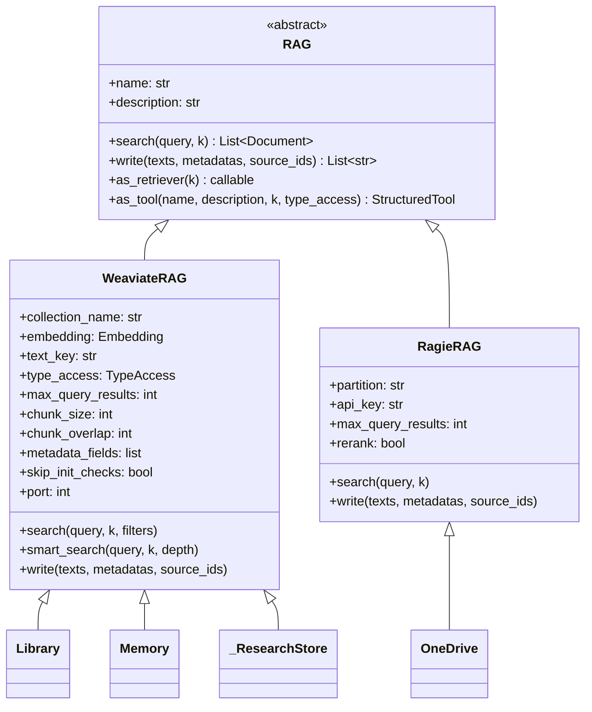

# rag/ — Interface RAG e Backends

Esta pasta define a interface abstrata de Retrieval-Augmented Generation e suas implementações concretas. Os stores específicos do domínio ficam em `stores/`.

---

## Estrutura

| Arquivo | Descrição |
|---------|-----------|
| `base.py` | `RAG` (ABC), `TypeAccess` enum |
| `weaviate.py` | `WeaviateRAG` — implementação local (Weaviate) |
| `ragie.py` | `RagieRAG` — implementação gerenciada (Ragie SaaS) |
| `rag.py` | Shim de compatibilidade (imports legados) |

---

## Hierarquia de Classes



---

## `RAG` — Interface Base (`base.py`)

### `TypeAccess`

| Valor | Permite busca | Permite escrita |
|-------|:---:|:---:|
| `TypeAccess.READ` | ✓ | — |
| `TypeAccess.WRITE` | — | ✓ |
| `TypeAccess.ALL` | ✓ | ✓ |

### `as_tool()` — exposição como ferramenta

Converte qualquer RAG em `StructuredTool` do LangChain com os parâmetros:

| Parâmetro | Quando disponível | Descrição |
|-----------|:-----------------:|-----------|
| `query: str` | `READ` ou `ALL` | Busca semântica |
| `text_to_save: str` | `WRITE` ou `ALL` | Indexa novo texto |
| `metadata: dict` | `WRITE` ou `ALL` | Metadados do texto indexado |

```python
# Expõe como tool de leitura+escrita
tool = Memory().as_tool(type_access=TypeAccess.ALL)

# Expõe como tool de leitura apenas (padrão)
tool = Library().as_tool()
```

---

## `WeaviateRAG` (`weaviate.py`)

Implementação de RAG usando Weaviate como banco vetorial local.

### Atributos declarativos

| Atributo | Tipo | Padrão | Descrição |
|----------|------|--------|-----------|
| `collection_name` | `str` | — | Nome da coleção no Weaviate |
| `embedding` | `Embedding` | — | Provider de embeddings |
| `text_key` | `str` | `"content"` | Campo de texto na coleção |
| `type_access` | `TypeAccess` | `READ` | Controle de acesso |
| `max_query_results` | `int` | `5` | Máx. resultados por busca |
| `chunk_size` | `int` | `512` | Tamanho dos chunks para indexação |
| `chunk_overlap` | `int` | `64` | Sobreposição entre chunks |
| `metadata_fields` | `list[str]` | `[]` | Campos de metadados a retornar |
| `skip_init_checks` | `bool` | `False` | Pula verificação de coleção |
| `port` | `int` | `8080` | Porta do Weaviate (localhost) |

### Exemplo

```python
from rag.weaviate import WeaviateRAG
from rag.base import TypeAccess
from embeddings.openai import OpenAIEmbedding

class MeuStore(WeaviateRAG):
    description     = "Base de artigos de suporte"
    collection_name = "ZEUS_Suporte"
    embedding       = OpenAIEmbedding("text-embedding-3-small")
    type_access     = TypeAccess.ALL
    metadata_fields = ["autor", "data", "categoria"]
```

---

## `RagieRAG` (`ragie.py`)

Implementação de RAG usando [Ragie](https://ragie.ai) como backend gerenciado. O Ragie cuida de chunking, embedding e indexação.

### Atributos declarativos

| Atributo | Tipo | Padrão | Descrição |
|----------|------|--------|-----------|
| `partition` | `str` | `"default"` | Partição/namespace no Ragie |
| `api_key` | `str` | `RAGIE_API_KEY` (env) | Chave de API |
| `max_query_results` | `int` | `5` | Máx. resultados por busca |
| `rerank` | `bool` | `True` | Reranking nos resultados |

### Metadata retornado por `search()`

Cada `Document` retornado inclui os seguintes campos em `metadata`:

| Campo | Tipo | Origem | Descrição |
|-------|------|--------|-----------|
| `document_id` | `str` | chunk | ID único do documento no Ragie |
| `document_name` | `str` | chunk | Nome do arquivo (ex: `"Manual.pdf"`) |
| `score` | `float` | chunk | Score de relevância (relativo à query) |
| `start_page` | `int \| None` | chunk.metadata | Página inicial — disponível para `.pdf` e `.pptx` |
| `end_page` | `int \| None` | chunk.metadata | Página final — disponível para `.pdf` e `.pptx` |
| `start_time` | `float \| None` | chunk.metadata | Tempo inicial em segundos — disponível para vídeo/áudio |
| `end_time` | `float \| None` | chunk.metadata | Tempo final em segundos — disponível para vídeo/áudio |
| _(outros)_ | — | chunk.document_metadata | Metadados extras definidos no documento (ex: `folder`, `source_url`, `file_path`) |

> **Nota:** `start_page`/`end_page` e `start_time`/`end_time` são `None` para arquivos que não suportam esses campos (ex: `.md`, `.docx`, `.xlsx`).

### Diferenças em relação ao WeaviateRAG

| Aspecto | WeaviateRAG | RagieRAG |
|---------|-------------|----------|
| Infraestrutura | Weaviate local/self-hosted | SaaS (Ragie) |
| Embeddings | Configurável (OpenAI, etc.) | Gerenciado pelo Ragie |
| Chunking | Configurável | Gerenciado pelo Ragie |
| Reranking | flashrank (local) | Nativo do Ragie |
| `write()` | Chunks + upsert no Weaviate | Ingest raw text no Ragie |

### Exemplo

```python
from rag.ragie import RagieRAG
from rag.base import TypeAccess

class OneDrive(RagieRAG):
    description = "Documentos corporativos do OneDrive"
    partition   = "onedrive-prod"
    type_access = TypeAccess.READ
```

---

## Exemplo Completo de Uso

Cenário: criar um store de **procedimentos operacionais** (Weaviate) e um store de **documentos de RH** (Ragie), indexar documentos, buscar e expor como ferramentas num Model.

### 1. WeaviateRAG — ciclo completo (escrita, busca, uso como tool)

```python
from embeddings.openai import OpenAIEmbedding
from rag.base import TypeAccess
from rag.weaviate import WeaviateRAG


# Definir o store
class ProcedimentosStore(WeaviateRAG):
    description = """
        Base de procedimentos operacionais de campo.
        Use para buscar guias de instalação, manutenção e operação de PICs.
    """
    collection_name   = "ZEUS_Procedimentos"
    embedding         = OpenAIEmbedding("text-embedding-3-large")
    type_access       = TypeAccess.ALL    # leitura e escrita
    max_query_results = 5
    metadata_fields   = ["titulo", "versao", "categoria", "autor"]
    chunk_size        = 512
    chunk_overlap     = 64
    skip_init_checks  = False             # verifica/cria coleção no Weaviate
    port              = 8080


store = ProcedimentosStore()

# --- ESCRITA ---
ids = store.write(
    texts=[
        """Procedimento de substituição de bateria do PIC-4.
        Materiais: chave torx T8, bateria LiPo 3.7V 2000mAh.
        Passo 1: desligar o PIC. Passo 2: remover parafusos traseiros.
        Passo 3: substituir a bateria. Passo 4: religar e verificar carga.""",

        """Procedimento de instalação de antena LoRa.
        Altura mínima: 3 metros acima do chão.
        Orientação: vertical, afastada de estruturas metálicas.
        Fixação: usar suporte fornecido no kit.""",
    ],
    metadatas=[
        {"titulo": "Substituição de Bateria PIC-4", "versao": "1.2", "categoria": "manutenção", "autor": "eng_joao"},
        {"titulo": "Instalação de Antena LoRa",     "versao": "2.0", "categoria": "instalação",  "autor": "eng_maria"},
    ],
)
print(f"IDs indexados: {ids}")
# → ["wv-uuid-aaa", "wv-uuid-bbb", "wv-uuid-ccc"]  (pode gerar múltiplos por chunking)

# --- BUSCA SIMPLES ---
docs = store.search("como substituir bateria", k=3)
for doc in docs:
    print(doc.page_content[:80])
    print(doc.metadata)
    print("---")
# → Procedimento de substituição de bateria do PIC-4...
#   {"titulo": "Substituição de Bateria PIC-4", "versao": "1.2", ...}

# --- BUSCA COM FILTRO ---
docs_instalacao = store.search(
    query="instalação",
    k=5,
    filters={"categoria": "instalação"},
)

# --- SMART SEARCH (busca em múltiplas profundidades) ---
docs_smart = store.smart_search("altura antena LoRa", k=5, depth=3)
# depth=3 → faz 3 buscas com variações da query e mescla resultados

# --- COMO RETRIEVER (retorna callable) ---
retriever = store.as_retriever(k=4)
docs_via_retriever = retriever("procedimento de manutenção")

# --- COMO TOOL para uso em Models ---
tool_leitura = store.as_tool()
# → StructuredTool com input: {"query": str}
# → type_access=READ por padrão (não permite escrita)

tool_completo = store.as_tool(type_access=TypeAccess.ALL)
# → StructuredTool com inputs: {"query": str} e/ou {"text_to_save": str, "metadata": dict}
```

### 2. RagieRAG — busca em documentos gerenciados

```python
from rag.base import TypeAccess
from rag.ragie import RagieRAG


class DocumentosRH(RagieRAG):
    description = """
        Documentos de RH sincronizados do OneDrive corporativo.
        Use para buscar políticas, benefícios, procedimentos de onboarding e comunicados.
    """
    partition         = "rh-documentos"
    # api_key         = "..."  # padrão: RAGIE_API_KEY env var
    max_query_results = 5
    rerank            = True    # reranking nativo do Ragie


rh = DocumentosRH()

# --- BUSCA ---
docs = rh.search("política de home office", k=3)
for doc in docs:
    print(f"Score: {doc.metadata.get('score', 'N/A')}")
    print(doc.page_content[:120])
    print("---")

# --- ESCRITA (ingest raw text no Ragie) ---
ids = rh.write(
    texts=["Nova política de férias 2025: colaboradores ganham 5 dias extras..."],
    metadatas=[{"titulo": "Política de Férias 2025", "departamento": "RH"}],
)

# --- COMO TOOL ---
tool_rh = rh.as_tool(
    name="DocumentosRH",
    description="Busca políticas e procedimentos de RH",
    type_access=TypeAccess.READ,
)
```

### 3. Combinar ambos os stores num Model

```python
from langchain_core.prompts import ChatPromptTemplate, MessagesPlaceholder
from llm import LLM
from models.model import Model
from rag.base import TypeAccess


class OperacoesModel(Model):
    name        = "Operacoes"
    description = "Agente de operações com acesso a procedimentos e RH"
    llm         = LLM("gpt-5.4", temperature=0.1)
    tools       = [
        ProcedimentosStore().as_tool(),                          # READ
        ProcedimentosStore().as_tool(type_access=TypeAccess.ALL, # READ + WRITE
                                     name="SalvarProcedimento",
                                     description="Salva novo procedimento na base"),
        DocumentosRH().as_tool(),
    ]

    thought_labels = {
        "ProcedimentosStore": "Consultando procedimentos operacionais...",
        "SalvarProcedimento": "Salvando procedimento...",
        "DocumentosRH":       "Consultando documentos de RH...",
    }

    prompt = ChatPromptTemplate.from_messages([
        ("system", """Você gerencia operações de campo.
Para procedimentos técnicos: use ProcedimentosStore.
Para dúvidas sobre RH: use DocumentosRH.
Para salvar novos procedimentos documentados: use SalvarProcedimento."""),
        MessagesPlaceholder("chat_history"),
        ("human", "{input}"),
        MessagesPlaceholder("agent_scratchpad"),
    ])
```

---

## Como Criar um Novo Store

### Weaviate (local)

```python
# stores/meu_store.py
from embeddings.openai import OpenAIEmbedding
from rag.base import TypeAccess
from rag.weaviate import WeaviateRAG


class MeuStore(WeaviateRAG):
    description = """
        Base de procedimentos operacionais.
        Use para buscar procedimentos, normas e guias técnicos.
    """
    collection_name   = "ZEUS_Procedimentos"
    embedding         = OpenAIEmbedding("text-embedding-3-large")
    type_access       = TypeAccess.READ
    max_query_results = 5
    metadata_fields   = ["titulo", "versao", "departamento"]
    skip_init_checks  = True
    port              = 8080
```

### Ragie (gerenciado)

```python
# stores/meu_store_ragie.py
from rag.base import TypeAccess
from rag.ragie import RagieRAG


class MeuStoreRagie(RagieRAG):
    description = "Documentos de RH indexados no Ragie"
    partition   = "rh-documentos"
    type_access = TypeAccess.READ
```

### Usar como ferramenta num Model

```python
# models/meu_modelo.py
from stores.meu_store import MeuStore

class MeuModelo(Model):
    tools = [MeuStore().as_tool()]
```
