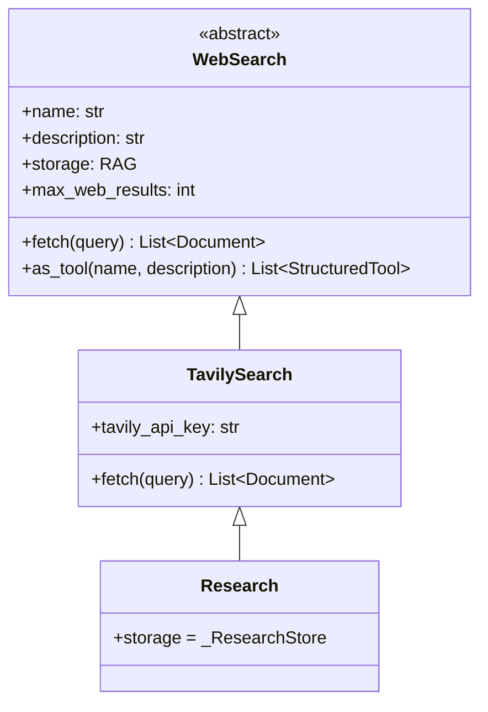

# search/ — Interface de Busca Web

Esta pasta define a interface abstrata para busca na web e sua implementação concreta (Tavily). O padrão suporta cache automático dos resultados em um backend RAG.

---

## Estrutura

| Arquivo | Descrição |
|---------|-----------|
| `base.py` | `WebSearch` (ABC) |
| `tavily.py` | `TavilySearch` |

---

## Hierarquia de Classes



---

## `WebSearch` — Interface Base (`base.py`)

### Atributos declarativos

| Atributo | Tipo | Padrão | Descrição |
|----------|------|--------|-----------|
| `name` | `str` | `""` | Nome base das tools geradas |
| `description` | `str` | `""` | Descrição para o LLM |
| `storage` | `RAG` ou classe | `None` | Backend de cache (instanciado automaticamente se for classe) |
| `max_web_results` | `int` | `5` | Máx. resultados por busca |

### `as_tool()` — duas ferramentas geradas

| Tool gerada | Nome | Sempre presente? | Descrição |
|-------------|------|:---:|-----------|
| WebSearch | `{name}_WebSearch` | Sim | Chama `fetch()`, custa créditos da API |
| ReadCache | `{name}_ReadCache` | Só se `storage` existe | Busca só no cache local, gratuito |

```python
# Desempacota as 2 tools para uso num Model:
tools = [*MeuSearch().as_tool()]
```

---

## `TavilySearch` (`tavily.py`)

Implementação usando a [API Tavily](https://tavily.com).

| Atributo | Padrão | Descrição |
|----------|--------|-----------|
| `tavily_api_key` | `TAVILY_API_KEY` (env) | Chave da API |

### Comportamento de `fetch()`

1. Chama a API Tavily com `max_results = self.max_web_results`
2. Converte resultados em `List[Document]` com metadados (`title`, `url`, `score`)
3. Se `self.storage` existe, indexa os documentos automaticamente no cache
4. Retorna os documentos

---

## Padrão de Uso pelo Agente

O padrão recomendado para economia de custo é instruir o LLM via prompt:

```
Use {name}_ReadCache antes de buscar na web.
Se não encontrar resultado relevante, use {name}_WebSearch.
```

---

## Exemplo Completo de Uso

Cenário: **NormasSearch** — fonte de busca especializada em regulamentações IoT que usa Tavily para buscar na web e Weaviate para cachear resultados, evitando chamadas repetidas.

### 1. Definir o store de cache e o buscador

```python
# stores/normas_search.py
from embeddings.openai import OpenAIEmbedding
from rag.base import TypeAccess
from rag.weaviate import WeaviateRAG
from search.tavily import TavilySearch


class _NormasCache(WeaviateRAG):
    """Cache local para resultados de busca de normas técnicas."""
    description       = "Cache de regulamentações e normas técnicas IoT"
    collection_name   = "ZEUS_NormasCache"
    embedding         = OpenAIEmbedding("text-embedding-3-small")
    type_access       = TypeAccess.ALL
    max_query_results = 10
    skip_init_checks  = True


class NormasSearch(TavilySearch):
    name            = "NormasSearch"
    description     = """Busca regulamentações, normas técnicas e legislação sobre IoT,
LoRa, dispositivos de telemetria e redes LPWAN.
Use NormasSearch_ReadCache antes de NormasSearch_WebSearch."""
    storage         = _NormasCache   # instanciado automaticamente
    max_web_results = 8
```

### 2. Usar diretamente (sem Model/Agent)

```python
from stores.normas_search import NormasSearch

ns = NormasSearch()

# --- BUSCA WEB (consome créditos Tavily) ---
docs = ns.fetch("ANATEL regulamentação LoRa 915MHz Brasil 2025")
for doc in docs:
    print(f"Título:  {doc.metadata.get('title', 'N/A')}")
    print(f"URL:     {doc.metadata.get('url',   'N/A')}")
    print(f"Score:   {doc.metadata.get('score', 0):.2f}")
    print(f"Trecho:  {doc.page_content[:120]}")
    print("---")
# → Os resultados são automaticamente salvos no _NormasCache

# --- LEITURA DO CACHE (gratuito, sem chamada à Tavily) ---
docs_cache = ns.storage.search("ANATEL LoRa 915MHz", k=5)
print(f"Cache: {len(docs_cache)} documentos encontrados")

# Verificar se o cache tem a informação antes de buscar na web:
cache_docs = ns.storage.search("regulamentação ANATEL IoT", k=3)
if cache_docs:
    print("Usando cache — sem custo Tavily")
    resultado = cache_docs
else:
    print("Cache vazio — buscando na web")
    resultado = ns.fetch("regulamentação ANATEL IoT")
```

### 3. Usar como tools num Model (padrão recomendado)

```python
# models/normas_model.py
from langchain_core.prompts import ChatPromptTemplate, MessagesPlaceholder
from llm import LLM
from models.model import Model
from stores.normas_search import NormasSearch


class NormasModel(Model):
    name        = "Normas"
    description = "Especialista em regulamentações técnicas IoT e LPWAN"
    llm         = LLM("gpt-5.4", temperature=0.1)
    tools       = [*NormasSearch().as_tool()]
    # → [NormasSearch_WebSearch, NormasSearch_ReadCache]

    thought_labels = {
        "NormasSearch_ReadCache": "Verificando cache de normas...",
        "NormasSearch_WebSearch": "Buscando regulamentações na internet...",
    }

    prompt = ChatPromptTemplate.from_messages([
        ("system", """Você é especialista em regulamentações técnicas para IoT e LPWAN.

IMPORTANTE — estratégia de custo:
1. Sempre use NormasSearch_ReadCache primeiro
2. Somente use NormasSearch_WebSearch se o cache não trouxer resultado relevante
3. Cite sempre a fonte (URL) das regulamentações encontradas
4. Destaque prazos, penalidades e órgãos reguladores"""),
        MessagesPlaceholder("chat_history"),
        ("human", "{input}"),
        MessagesPlaceholder("agent_scratchpad"),
    ])


# --- Exemplo de invocação ---
model = NormasModel()

resultado = model.invoke({
    "input": "Qual a potência máxima permitida para dispositivos LoRa na faixa de 915 MHz no Brasil?",
    "chat_history": [],
})
print(resultado["output"])
# → "Segundo a Resolução ANATEL nº 680/2017, dispositivos de curto alcance na faixa de
#    915 MHz podem operar com potência máxima de 30 dBm (1W)..."
print(resultado["thought"])
# → "Ação: NormasSearch_ReadCache\nInput: LoRa 915MHz potência ANATEL\n
#    Observação: [cache miss]\nAção: NormasSearch_WebSearch\n..."
```

### 4. Simular o fluxo cache-first de forma manual

```python
from stores.normas_search import NormasSearch, _NormasCache

ns     = NormasSearch()
cache  = _NormasCache()

query  = "FCC Part 15 LoRa 915MHz power limit"

# Passo 1: verificar cache
cache_resultado = cache.search(query, k=3)

if cache_resultado and cache_resultado[0].metadata.get("score", 0) > 0.75:
    print(f"Cache HIT ({len(cache_resultado)} docs)")
    for doc in cache_resultado:
        print(f"  {doc.page_content[:100]}")
else:
    print("Cache MISS — buscando na web...")
    web_resultado = ns.fetch(query)
    # ↑ automaticamente salva no cache para próximas buscas
    print(f"Web: {len(web_resultado)} resultados indexados no cache")
    for doc in web_resultado:
        print(f"  [{doc.metadata.get('url', '')}] {doc.page_content[:80]}")
```

---

## Como Criar uma Nova Fonte de Busca

### Sem cache

```python
# search/meu_search.py
from typing import List
from langchain_core.documents import Document
from search.base import WebSearch


class MeuSearch(WebSearch):
    name        = "MeuSearch"
    description = "Busca em base interna de artigos"

    def fetch(self, query: str) -> List[Document]:
        resultados = minha_api.search(query, limit=self.max_web_results)
        return [
            Document(
                page_content=r["texto"],
                metadata={"fonte": r["url"], "data": r["data"]}
            )
            for r in resultados
        ]
```

### Com cache em Weaviate

```python
# stores/meu_search_store.py
from embeddings.openai import OpenAIEmbedding
from rag.base import TypeAccess
from rag.weaviate import WeaviateRAG
from search.tavily import TavilySearch


class _Cache(WeaviateRAG):
    collection_name = "ZEUS_MeuSearch"
    embedding       = OpenAIEmbedding("text-embedding-3-small")
    type_access     = TypeAccess.ALL


class MeuSearch(TavilySearch):
    name        = "MeuSearch"
    description = "Busca regulamentações com cache local"
    storage     = _Cache   # instanciado automaticamente
```

### Uso num Model

```python
class MeuModelo(Model):
    tools = [*MeuSearch().as_tool()]
    # → [MeuSearch_WebSearch, MeuSearch_ReadCache]
```
