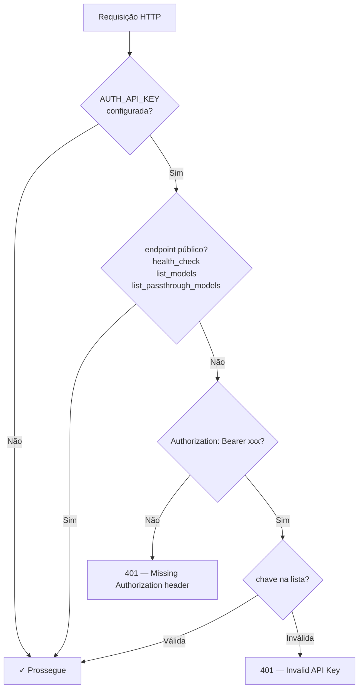
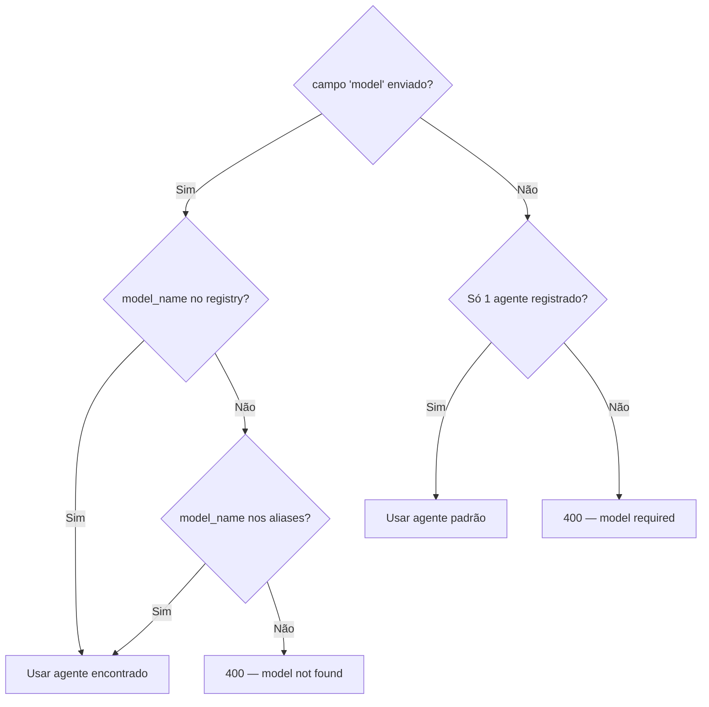
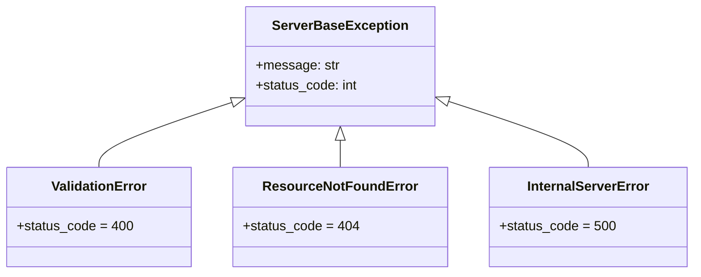

# server/ — Servidor HTTP e API OpenAI-Compatível

Esta pasta contém o servidor Flask singleton que expõe os agentes como API HTTP no formato OpenAI.

---

## Estrutura

| Arquivo | Descrição |
|---------|-----------|
| `server.py` | `Server` singleton, rotas, auth, SSE, formato OpenAI |
| `exceptions.py` | Hierarquia de exceções com status HTTP |

---

## `Server` (`server.py`)

Singleton Flask. Acesse sempre via `Server.get_instance()`.

### Registros internos

| Atributo | Tipo | Descrição |
|----------|------|-----------|
| `chat_model_registry` | `Dict[str, dict]` | `model_name → {agent, created, owned_by, aliases, hidden, passthrough}` |
| `chat_alias_registry` | `Dict[str, str]` | `alias → model_name` |
| `url_handlers` | `List` | Handlers de tool endpoints registrados |

---

## Rotas

### Públicas (sem auth)

| Método | Rota | Endpoint name | Descrição |
|--------|------|---------------|-----------|
| `GET` | `/health` | `health_check` | Health check |
| `GET` | `/models` | `list_models` | Lista agentes não-hidden |
| `GET` | `/v1/models` | `list_models` | Idem (alias OpenAI) |
| `GET` | `/passthrough` | `list_passthrough_models` | Lista modelos passthrough |

### Protegidas (Bearer token)

| Método | Rota | Descrição |
|--------|------|-----------|
| `POST` | `/chat/completions` | Chat não-streaming ou streaming |
| `POST` | `/v1/chat/completions` | Idem (alias OpenAI) |
| Dinâmico | `/{url}` | Tool endpoints registrados por Agents |

---

## Autenticação

`before_request` valida o header `Authorization: Bearer <key>` em todas as rotas protegidas. Se `AUTH_API_KEY` não estiver definida, a autenticação é desabilitada por completo.



A validação compara o Bearer token contra `AUTH_API_KEY` (env var, lista separada por vírgula). Em desenvolvimento local, basta omitir a variável para rodar sem auth.

---

## Resolução de Modelo



---

## Streaming SSE e `ThoughtStreamMode`

### Modos disponíveis

| Modo | Valor na request | Comportamento |
|------|-----------------|---------------|
| `content` | `"content"` (padrão) | Pensamentos embutidos como `<think>...</think>` no conteúdo |
| `custom` | `"custom"` | Pensamentos em campo `"reasoning"` separado no delta |
| `hidden` | `"hidden"` | Pensamentos suprimidos |

### Formato SSE por evento

| Evento do agent | Formato SSE emitido |
|-----------------|---------------------|
| `{"content": "texto"}` | `data: {"choices":[{"delta":{"content":"texto"}}]}\n\n` |
| `{"thought": "..."}` mode=content | `data: {"choices":[{"delta":{"content":"<think>\n• ..."}}}]}\n\n` |
| `{"thought": "..."}` mode=custom | `data: {"choices":[{"delta":{"reasoning":"..."}}]}\n\n` |
| `{"thought": "..."}` mode=hidden | (nada emitido) |
| `{"keepalive": True}` | `: keepalive\n\n` |
| stream encerrado | `data: {"choices":[{"delta":{},"finish_reason":"stop"}]}\n\n` + `data: [DONE]\n\n` |

---

## Contagem de Tokens

Toda resposta inclui `usage` calculado via tiktoken:

```json
{ "usage": { "prompt_tokens": 150, "completion_tokens": 300, "total_tokens": 450 } }
```

Em streaming, ative com `stream_options: {"include_usage": true}` na request para receber um chunk final com `usage`.

---

## `exceptions.py` — Hierarquia de Exceções



### Uso em tool endpoints

```python
from server.exceptions import ValidationError, ResourceNotFoundError

# Em um callback de tool endpoint:
if not param:
    raise ValidationError("param é obrigatório")

if not encontrado:
    raise ResourceNotFoundError("recurso não encontrado")
```

`Agent._tool_callback()` captura `ServerBaseException` e retorna o status HTTP correto automaticamente.

---

## Exemplo Completo de Uso

Cenário: interagir com o servidor em todos os modos — verificar saúde, listar agentes, fazer chat não-streaming, streaming com thought modes, usar passthrough e um tool endpoint.

### 1. Verificar saúde e listar agentes

```bash
# Health check
curl http://localhost:6001/health
# → {"status": "ok"}

# Listar agentes disponíveis
curl http://localhost:6001/v1/models
# {
#   "object": "list",
#   "data": [
#     {"id": "Athena",  "object": "model", "owned_by": "Zeus"},
#     {"id": "Saori",   "object": "model", "owned_by": "Zeus"},
#     {"id": "OneDrive","object": "model", "owned_by": "Zeus"}
#   ]
# }

# Listar modelos passthrough (acesso direto ao provider)
curl http://localhost:6001/passthrough
# {
#   "object": "list",
#   "data": [
#     {"id": "gpt-5.4",       "object": "model", "owned_by": "openai"},
#     {"id": "gpt-5-mini",    "object": "model", "owned_by": "openai"},
#     {"id": "gpt-5.4-mini",  "object": "model", "owned_by": "openai"},
#     {"id": "gpt-5.4-nano",  "object": "model", "owned_by": "openai"}
#   ]
# }
```

### 2. Chat não-streaming

```bash
curl -X POST http://localhost:6001/v1/chat/completions \
  -H "Authorization: Bearer sk_xxxxx" \
  -H "Content-Type: application/json" \
  -d '{
    "model": "Athena",
    "messages": [
      {"role": "system",  "content": "Contexto adicional do sistema (opcional)"},
      {"role": "user",    "content": "Quais PICs do cliente 42 estão offline?"}
    ],
    "temperature": 0.2,
    "max_tokens": 1024,
    "stream": false
  }'
```

**Resposta:**
```json
{
  "id": "chatcmpl-abc123",
  "object": "chat.completion",
  "created": 1744200000,
  "model": "Athena",
  "choices": [{
    "index": 0,
    "message": {
      "role": "assistant",
      "content": "O cliente 42 possui 5 PICs offline: 1001, 1002, 1003, 1004 e 1005..."
    },
    "finish_reason": "stop"
  }],
  "usage": {
    "prompt_tokens": 210,
    "completion_tokens": 85,
    "total_tokens": 295
  },
  "thought": "Ação: get_park_overview\nObservação: 5 offline...\nAção: get_pics\nObservação: [1001, 1002, ...]"
}
```

### 3. Chat streaming — todos os `thought_stream_mode`

**Modo `content` (padrão) — pensamentos embutidos no conteúdo:**

```bash
curl -X POST http://localhost:6001/v1/chat/completions \
  -H "Authorization: Bearer sk_xxxxx" \
  -H "Content-Type: application/json" \
  -d '{
    "model": "Saori",
    "messages": [{"role": "user", "content": "Resumo rápido do parque Beta"}],
    "stream": true,
    "thought_stream_mode": "content"
  }'
```

```
data: {"id":"chatcmpl-x","object":"chat.completion.chunk","model":"Saori","choices":[{"delta":{"role":"assistant"},"index":0}]}
data: {"id":"chatcmpl-x","choices":[{"delta":{"content":"<think>\nObtendo visão geral do parque...\n</think>"},"index":0}]}
data: {"id":"chatcmpl-x","choices":[{"delta":{"content":"O parque Beta possui 3 PICs online e 1 em standby..."},"index":0}]}
data: {"id":"chatcmpl-x","choices":[{"delta":{},"finish_reason":"stop","index":0}]}
data: [DONE]
```

**Modo `custom` — pensamentos em campo separado:**

```bash
curl -X POST http://localhost:6001/v1/chat/completions \
  -H "Authorization: Bearer sk_xxxxx" \
  -H "Content-Type: application/json" \
  -d '{
    "model": "Athena",
    "messages": [{"role": "user", "content": "Diagnóstico completo do parque Alpha"}],
    "stream": true,
    "thought_stream_mode": "custom"
  }'
```

```
data: {"choices":[{"delta":{"reasoning":"Realizando diagnóstico completo..."},"index":0}]}
data: {"choices":[{"delta":{"content":"Analisando o parque Alpha, encontrei os seguintes problemas..."},"index":0}]}
data: {"choices":[{"delta":{},"finish_reason":"stop","index":0}]}
data: [DONE]
```

**Modo `hidden` — sem pensamentos (resposta mais limpa):**

```bash
curl -X POST http://localhost:6001/v1/chat/completions \
  -H "Authorization: Bearer sk_xxxxx" \
  -H "Content-Type: application/json" \
  -d '{
    "model": "Athena",
    "messages": [{"role": "user", "content": "Status do parque"}],
    "stream": true,
    "thought_stream_mode": "hidden"
  }'
```

### 4. Streaming com contagem de tokens

```bash
curl -X POST http://localhost:6001/v1/chat/completions \
  -H "Authorization: Bearer sk_xxxxx" \
  -H "Content-Type: application/json" \
  -d '{
    "model": "Saori",
    "messages": [{"role": "user", "content": "Resumo do parque"}],
    "stream": true,
    "stream_options": {"include_usage": true}
  }'
```

```
data: {"choices":[{"delta":{"content":"O parque..."},"index":0}]}
data: {"choices":[{"delta":{},"finish_reason":"stop"}],"usage":{"prompt_tokens":45,"completion_tokens":120,"total_tokens":165}}
data: [DONE]
```

### 5. Passthrough — acesso direto ao provider

```bash
# Usar gpt-5-mini diretamente (sem passar pelo AgentExecutor)
curl -X POST http://localhost:6001/v1/chat/completions \
  -H "Authorization: Bearer sk_xxxxx" \
  -H "Content-Type: application/json" \
  -d '{
    "model": "gpt-5-mini",
    "messages": [{"role": "user", "content": "Olá!"}],
    "temperature": 0.5,
    "max_tokens": 100,
    "stream": false
  }'
```

### 6. Usando com Python `openai` SDK (compatibilidade total)

```python
from openai import OpenAI

client = OpenAI(
    api_key="sk_xxxxx",
    base_url="http://localhost:6001/v1",
)

# Não-streaming
response = client.chat.completions.create(
    model="Athena",
    messages=[
        {"role": "system", "content": "Responda de forma concisa"},
        {"role": "user",   "content": "Quantos PICs estão offline no parque Alpha?"},
    ],
    temperature=0.2,
    extra_body={"thought_stream_mode": "hidden"},  # parâmetro exclusivo
)
print(response.choices[0].message.content)

# Streaming
stream = client.chat.completions.create(
    model="Saori",
    messages=[{"role": "user", "content": "Resumo rápido"}],
    stream=True,
    extra_body={"thought_stream_mode": "custom"},
)
for chunk in stream:
    delta = chunk.choices[0].delta
    if delta.content:
        print(delta.content, end="", flush=True)
```

### 7. Tratamento de erros da API

```bash
# 401 — token ausente
curl -X POST http://localhost:6001/v1/chat/completions \
  -H "Content-Type: application/json" \
  -d '{"model": "Athena", "messages": [{"role": "user", "content": "teste"}]}'
# → {"error": "Missing Authorization header"} (HTTP 401)

# 401 — token inválido
curl -X POST http://localhost:6001/v1/chat/completions \
  -H "Authorization: Bearer sk_invalida" \
  -H "Content-Type: application/json" \
  -d '{"model": "Athena", "messages": [{"role": "user", "content": "teste"}]}'
# → {"error": "Invalid API Key"} (HTTP 401)

# 400 — modelo não encontrado
curl -X POST http://localhost:6001/v1/chat/completions \
  -H "Authorization: Bearer sk_xxxxx" \
  -H "Content-Type: application/json" \
  -d '{"model": "NaoExiste", "messages": [{"role": "user", "content": "teste"}]}'
# → {"error": "model not found: NaoExiste"} (HTTP 400)
```

---

## Como Adicionar uma Rota Customizada

Para rotas permanentes do servidor (não de agentes específicos), adicione em `_setup_default_routes()`:

```python
# Em server/server.py, dentro de _setup_default_routes():

@self.app.route("/version", methods=["GET"])
def version_info():
    return jsonify({
        "service": "olympus-ai-backend",
        "version": "2.0.0"
    })
```

Se a rota for pública, adicione o endpoint name na lista de isenção do `before_request`:

```python
if request.endpoint in ("health_check", "list_models", "list_passthrough_models", "version_info"):
    return
```
