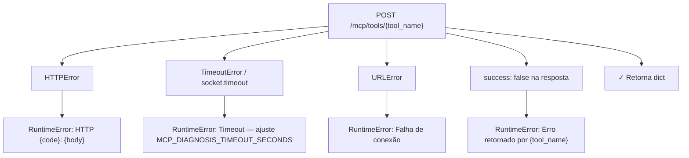

# services/ — Clientes de Microserviços

Esta pasta contém clientes HTTP para serviços externos ao backend. Cada serviço encapsula autenticação, serialização e tratamento de erros.

---

## Estrutura

| Arquivo | Descrição |
|---------|-----------|
| `mcp_diagnosis.py` | `MCPDiagnosisService` — cliente do serviço MCP Diagnosis |
| `__init__.py` | Exporta `MCPDiagnosisService` |

---

## `MCPDiagnosisService` (`mcp_diagnosis.py`)

Cliente HTTP para o microserviço MCP Diagnosis, responsável por diagnósticos de PICs (dispositivos IoT) instalados nos parques.

### Configuração

| Variável de ambiente | Padrão | Descrição |
|----------------------|--------|-----------|
| `MCP_DIAGNOSIS_BASE_URL` | URL de produção | Base URL do serviço |
| `MCP_DIAGNOSIS_AUTH_TOKEN` | Token padrão | Bearer token de autenticação |
| `MCP_DIAGNOSIS_TIMEOUT_SECONDS` | `300` | Timeout em segundos (`0` = sem limite) |

```python
from services.mcp_diagnosis import MCPDiagnosisService

mcp = MCPDiagnosisService()  # usa variáveis de ambiente

# Ou configuração explícita:
mcp = MCPDiagnosisService(
    base_url="https://minha-url.run.app",
    auth_token="sk_meutoken",
    timeout_seconds=60.0,
)
```

---

## Métodos Disponíveis

Todos fazem `POST /mcp/tools/{tool_name}`. Retornam string TOON (padrão) ou `dict` (se `as_toon=False`).

### `get_park_info()`

```python
mcp.get_park_info(
    reference_date="2025-01-15T00:00:00Z",  # str, datetime ou date
    window_days=7,
    status_list=["offline", "standby"],
    model_list=["PIC-3", "PIC-4"],
    as_toon=True,
)
```

### `get_pics()`

```python
mcp.get_pics(
    client_id_list=[1, 2, 3],
    pic_id_list=[1001, 1002],
    hardware_id_list=[10, 20],
    status_list=["offline"],
    model_list=["PIC-3"],
    columns=["pic_id", "status", "last_seen"],
    limit=100,
    visible=True,
    as_toon=True,
)
```

### Diagnósticos de Hardware

Todos têm a mesma assinatura: `(pic_id_list, client_id_list, hardware_id_list, reference_date, as_toon)`.

| Método | Tool MCP | O que verifica |
|--------|----------|----------------|
| `check_lora_network()` | `check_lora_network` | Conectividade LoRa |
| `check_wifi_network()` | `check_wifi_network` | Conectividade WiFi |
| `check_battery()` | `check_battery` | Saúde da bateria |
| `check_solar_panel()` | `check_solar_panel` | Painel solar |

---

## Internals

### Tratamento de erros em `_post()`



### `_normalize_reference_date()`

| Entrada | Saída |
|---------|-------|
| `"2025-01-15"` | `"2025-01-15T00:00:00Z"` |
| `datetime(2025, 1, 15, 10, 0)` | `"2025-01-15T10:00:00Z"` |
| `date(2025, 1, 15)` | `"2025-01-15T00:00:00Z"` |
| `None` | `None` |

### `_clean_payload()`

Remove do payload antes de enviar: campos `None`, strings vazias e listas/dicts vazios.

### Formato TOON

Por padrão (`as_toon=True`), as respostas são convertidas para TOON via `tools.toon.encode_toon()`. Para JSON puro:
```python
resultado = mcp.get_pics(pic_id_list=[1001], as_toon=False)  # → dict
```

---

## Exemplo Completo de Uso

Cenário: executar um diagnóstico completo de um parque, identificar PICs problemáticos e gerar um relatório consolidado.

### 1. Diagnóstico completo de um parque

```python
from datetime import date
from services.mcp_diagnosis import MCPDiagnosisService

mcp = MCPDiagnosisService()

# Data de referência para o diagnóstico
ref_date = date(2025, 4, 9)

# --- Visão geral do parque ---
overview = mcp.get_park_info(
    reference_date=ref_date,
    window_days=7,
    status_list=["offline", "standby"],
    model_list=["PIC-3", "PIC-4"],
    as_toon=False,   # dict para processar programaticamente
)
print(f"Total offline: {overview.get('offline_count', 0)}")
print(f"Total standby: {overview.get('standby_count', 0)}")

# --- Listar PICs problemáticos de um cliente ---
pics_offline = mcp.get_pics(
    client_id_list=[42],
    status_list=["offline"],
    columns=["pic_id", "hardware_id", "status", "last_seen", "modelo"],
    limit=50,
    visible=True,
    as_toon=False,
)

pic_ids      = [p["pic_id"]      for p in pics_offline.get("pics", [])]
hardware_ids = [p["hardware_id"] for p in pics_offline.get("pics", [])]
print(f"PICs offline: {pic_ids}")

# --- Diagnóstico em paralelo (LoRa, WiFi, bateria, solar) ---
import concurrent.futures

def diag_lora():
    return mcp.check_lora_network(
        pic_id_list=pic_ids[:10],       # limitar para não sobrecarregar
        reference_date=ref_date,
        as_toon=False,
    )

def diag_bateria():
    return mcp.check_battery(
        pic_id_list=pic_ids[:10],
        reference_date=ref_date,
        as_toon=False,
    )

def diag_solar():
    return mcp.check_solar_panel(
        pic_id_list=pic_ids[:10],
        reference_date=ref_date,
        as_toon=False,
    )

with concurrent.futures.ThreadPoolExecutor(max_workers=3) as executor:
    fut_lora    = executor.submit(diag_lora)
    fut_bateria = executor.submit(diag_bateria)
    fut_solar   = executor.submit(diag_solar)

    resultado_lora    = fut_lora.result()
    resultado_bateria = fut_bateria.result()
    resultado_solar   = fut_solar.result()

print("LoRa com falha:",    [r["pic_id"] for r in resultado_lora.get("falhas", [])])
print("Bateria crítica:",   [r["pic_id"] for r in resultado_bateria.get("criticos", [])])
print("Solar com problema:", [r["pic_id"] for r in resultado_solar.get("problemas", [])])
```

### 2. Usar no formato TOON (para passar ao LLM)

```python
mcp = MCPDiagnosisService()

# TOON — formato otimizado para contexto do LLM
resumo_toon = mcp.get_park_info(
    reference_date="2025-04-09",
    window_days=7,
    as_toon=True,   # padrão
)
print(resumo_toon)
# → "Park Overview (2025-04-09, 7 dias)\n  offline: 12\n  standby: 4\n  ..."

pics_toon = mcp.get_pics(
    client_id_list=[42],
    status_list=["offline"],
    columns=["pic_id", "status", "last_seen"],
    as_toon=True,
)
print(pics_toon[:300])
# → "PICs\n  [1001] status=offline last_seen=2025-04-07T14:22Z\n  ..."
```

### 3. Expor como tools num Model (integração completa)

```python
from langchain_core.tools import tool
from langchain_core.prompts import ChatPromptTemplate, MessagesPlaceholder
from llm import LLM
from models.model import Model
from services.mcp_diagnosis import MCPDiagnosisService

_mcp = MCPDiagnosisService()


@tool
def get_park_overview(reference_date: str = None, window_days: int = 7) -> str:
    """Retorna visão geral do parque: PICs offline, standby e métricas gerais."""
    return _mcp.get_park_info(
        reference_date=reference_date,
        window_days=window_days,
    )


@tool
def get_pics(client_id: int, status: str = "offline") -> str:
    """Lista PICs de um cliente com determinado status."""
    return _mcp.get_pics(
        client_id_list=[client_id],
        status_list=[status],
        columns=["pic_id", "status", "last_seen", "modelo"],
    )


@tool
def run_complete_diagnosis(pic_ids: list[int], reference_date: str = None) -> str:
    """Executa diagnóstico completo (LoRa + bateria + solar) em paralelo para uma lista de PICs."""
    import concurrent.futures
    with concurrent.futures.ThreadPoolExecutor(max_workers=3) as ex:
        futs = {
            "LoRa":   ex.submit(_mcp.check_lora_network,  pic_id_list=pic_ids, reference_date=reference_date),
            "Bateria": ex.submit(_mcp.check_battery,       pic_id_list=pic_ids, reference_date=reference_date),
            "Solar":   ex.submit(_mcp.check_solar_panel,   pic_id_list=pic_ids, reference_date=reference_date),
        }
        return "\n\n".join(f"=== {k} ===\n{f.result()}" for k, f in futs.items())


class DiagnosticModel(Model):
    name        = "Diagnostic"
    description = "Realiza diagnósticos completos de PICs em parques"
    llm         = LLM("gpt-5.4", temperature=0.1)
    tools       = [get_park_overview, get_pics, run_complete_diagnosis]

    thought_labels = {
        "get_park_overview":      "Obtendo visão geral do parque...",
        "get_pics":               "Listando PICs...",
        "run_complete_diagnosis": "Executando diagnóstico completo...",
    }

    prompt = ChatPromptTemplate.from_messages([
        ("system", """Você é um especialista em diagnóstico de PICs (dispositivos IoT).
1. Comece com get_park_overview para entender o estado geral
2. Use get_pics para identificar dispositivos problemáticos
3. Use run_complete_diagnosis para análise profunda
4. Apresente conclusões com priorização de urgência"""),
        MessagesPlaceholder("chat_history"),
        ("human", "{input}"),
        MessagesPlaceholder("agent_scratchpad"),
    ])


# --- Invocar ---
model = DiagnosticModel()
resultado = model.invoke({
    "input": "Analise o estado dos PICs do cliente 42 e identifique os mais críticos",
    "chat_history": [],
})
print(resultado["output"])
```

### 4. Configuração para diferentes ambientes

```python
import os

# Desenvolvimento — apontar para serviço local ou staging
mcp_dev = MCPDiagnosisService(
    base_url="http://localhost:8090",
    auth_token="dev-token-local",
    timeout_seconds=30.0,
)

# Produção — usa variáveis de ambiente
mcp_prod = MCPDiagnosisService()
# MCP_DIAGNOSIS_BASE_URL=https://mcp.prod.run.app
# MCP_DIAGNOSIS_AUTH_TOKEN=sk_prod_xxxxx
# MCP_DIAGNOSIS_TIMEOUT_SECONDS=300

# Teste de conectividade
try:
    resultado = mcp_dev.get_park_info(window_days=1, as_toon=False)
    print("Conectado ao MCP Diagnosis ✓")
except RuntimeError as e:
    print(f"Falha na conexão: {e}")
```

---

## Como Adicionar um Novo Método

```python
def check_temperature(
    self,
    pic_id_list: Optional[List[int]] = None,
    client_id_list: Optional[List[int]] = None,
    reference_date: Any = None,
    as_toon: bool = True,
):
    payload = {
        "pic_id_list": pic_id_list,
        "client_id_list": client_id_list,
        "reference_date": self._normalize_reference_date(reference_date),
    }
    response = self._post("check_temperature", payload)
    return self._format_response(response, as_toon)
```

---

## Como Adicionar um Novo Serviço

```python
# services/meu_servico.py
import json, os
from typing import Any, Dict, Optional
from urllib import error, request


class MeuServico:
    def __init__(self, base_url=None, auth_token=None, timeout_seconds=30.0):
        self.base_url       = (base_url or os.getenv("MEU_SERVICO_URL", "")).rstrip("/")
        self.auth_token     = auth_token or os.getenv("MEU_SERVICO_TOKEN", "")
        self.timeout_seconds = timeout_seconds

    def _post(self, endpoint: str, payload: Dict[str, Any]) -> Dict[str, Any]:
        body = json.dumps(payload).encode("utf-8")
        req  = request.Request(
            url=f"{self.base_url}/{endpoint}",
            data=body,
            headers={"Authorization": f"Bearer {self.auth_token}", "Content-Type": "application/json"},
            method="POST",
        )
        try:
            with request.urlopen(req, timeout=self.timeout_seconds) as resp:
                return json.loads(resp.read().decode("utf-8"))
        except error.HTTPError as exc:
            raise RuntimeError(f"HTTP {exc.code}: {exc.read().decode()}") from exc

    def minha_operacao(self, param: str) -> Dict[str, Any]:
        return self._post("minha-operacao", {"param": param})
```

Para expor como `@tool` num Model:

```python
from langchain_core.tools import tool
from services.meu_servico import MeuServico

_servico = MeuServico()

@tool
def minha_ferramenta(param: str) -> str:
    """Executa operação no meu serviço externo."""
    return str(_servico.minha_operacao(param))

class MeuModelo(Model):
    tools = [minha_ferramenta]
```
