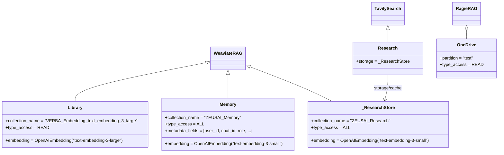

# stores/ — Stores de Conhecimento

Esta pasta contém os stores concretos do domínio: subclasses de `WeaviateRAG`, `RagieRAG` ou `TavilySearch` prontas para uso como ferramentas nos Models.

---

## Visão Geral



Stores são usados nos Models via `.as_tool()`:

```python
# models/athena.py
from stores.library import Library
from stores.memory import Memory

class AthenaModel(Model):
    tools = [
        Library().as_tool(),
        Memory().as_tool(type_access=TypeAccess.ALL),
    ]
```

---

## Stores Disponíveis

### `Library` (`library.py`)

| Atributo | Valor |
|----------|-------|
| Backend | Weaviate local |
| `collection_name` | `"VERBA_Embedding_text_embedding_3_large"` |
| `embedding` | `text-embedding-3-large` |
| `type_access` | `READ` (somente busca) |
| `max_query_results` | 5 |

Biblioteca técnica com documentação, manuais e procedimentos. Integra com [Verba](https://github.com/weaviate/Verba) se disponível.

---

### `Memory` (`memory.py`)

| Atributo | Valor |
|----------|-------|
| Backend | Weaviate local |
| `collection_name` | `"ZEUSAI_Memory"` |
| `embedding` | `text-embedding-3-small` |
| `type_access` | `ALL` (leitura e escrita) |
| `metadata_fields` | `user_id`, `chat_id`, `role`, `importance`, `timestamp`, `tags` |

Memória de longo prazo de conversas por usuário.

```python
memory = Memory()

# Salvar
memory.write(
    texts=["Usuário X prefere respostas curtas"],
    metadatas=[{"user_id": "123", "importance": "high", "tags": ["preferência"]}]
)

# Recuperar
docs = memory.search("preferências do usuário X", k=5)
```

---

### `Research` (`research.py`)

Combina busca web (Tavily) com cache em Weaviate. O método `.as_tool()` expõe **duas ferramentas**:

| Tool gerada | Custo | Quando usar |
|-------------|-------|-------------|
| `Research_WebSearch` | Créditos Tavily | Informações novas ou não cacheadas |
| `Research_ReadCache` | Gratuito | Sempre tentar primeiro |

```python
# Em um Model:
tools = [*Research().as_tool()]  # desempacota as 2 tools

# No prompt, instrua o agente:
# "Consulte Research_ReadCache primeiro. Se insuficiente, use Research_WebSearch."
```

---

### `OneDrive` (`onedrive.py`)

| Atributo | Valor |
|----------|-------|
| Backend | Ragie SaaS |
| `partition` | `"zeus-library"` |
| `type_access` | `READ` (somente busca) |

Documentos corporativos sincronizados do OneDrive via Ragie. Sem dependência de Weaviate local.

O metadata retornado inclui `document_name`, `source_url`, `file_path`, `folder`, `start_page`/`end_page` (PDFs) e `start_time`/`end_time` (vídeo/áudio). Veja detalhes em [rag/README.md](../rag/README.md#metadata-retornado-por-search).

---

## Dependências por Store

| Store | Infraestrutura | Variáveis necessárias |
|-------|---------------|----------------------|
| `Library` | Weaviate em `localhost:8080` | `OPENAI_API_KEY` |
| `Memory` | Weaviate em `localhost:8080` | `OPENAI_API_KEY` |
| `Research` | Weaviate em `localhost:8080` + Tavily | `OPENAI_API_KEY`, `TAVILY_API_KEY` |
| `OneDrive` | Ragie SaaS | `RAGIE_API_KEY` |

---

## Exemplo Completo de Uso

Cenário: um agente **AthenaAgent** que usa todos os stores disponíveis — Library para documentação técnica, Memory para lembrar o contexto do usuário, Research para busca web e OneDrive para documentos corporativos.

### 1. Usando cada store individualmente

```python
# -------------------------
# Library — documentação técnica (somente leitura)
# -------------------------
from stores.library import Library

lib = Library()
docs = lib.search("procedimento de calibração do sensor de umidade", k=5)
for doc in docs:
    print(f"[Library] {doc.page_content[:100]}")
    print(f"          metadata: {doc.metadata}")

# -------------------------
# Memory — memória de longo prazo por usuário
# -------------------------
from stores.memory import Memory

mem = Memory()

# Salvar fato importante durante a conversa
mem.write(
    texts=["Usuário João Souza prefere respostas concisas e sem jargão técnico"],
    metadatas=[{
        "user_id":    "joao.souza@empresa.com",
        "chat_id":    "session-2025-001",
        "role":       "preference",
        "importance": "high",
        "tags":       ["preferência", "estilo"],
        "timestamp":  "2025-04-09T14:30:00Z",
    }],
)

# Recuperar contexto do usuário em uma nova sessão
memorias = mem.search("preferências de João Souza", k=5)
for m in memorias:
    print(f"[Memory] {m.page_content}")

# -------------------------
# Research — busca web com cache
# -------------------------
from stores.research import Research

research = Research()

# as_tool() retorna DUAS tools: WebSearch e ReadCache
tools_research = research.as_tool()
# → [Research_WebSearch, Research_ReadCache]

# Acessar o cache diretamente (sem créditos Tavily)
cache_docs = research.storage.search("tendências IoT 2025", k=3)

# -------------------------
# OneDrive — documentos corporativos via Ragie
# -------------------------
from stores.onedrive import OneDrive

od = OneDrive()
docs_corp = od.search("contrato de fornecimento componentes eletrônicos", k=3)
for doc in docs_corp:
    print(f"[OneDrive] score={doc.metadata.get('score'):.2f} | {doc.page_content[:80]}")
```

### 2. Usando todos os stores num Model completo

```python
# models/athena.py (simplificado para demonstração)
from langchain_core.prompts import ChatPromptTemplate, MessagesPlaceholder
from llm import LLM
from models.model import Model
from rag.base import TypeAccess
from stores.library  import Library
from stores.memory   import Memory
from stores.research import Research
from stores.onedrive import OneDrive


class AthenaModel(Model):
    name        = "Athena"
    description = "Agente de análise com acesso completo à base de conhecimento"
    llm         = LLM("gpt-5.4", temperature=0.2)

    tools = [
        Library().as_tool(),                              # leitura: documentação técnica
        Memory().as_tool(type_access=TypeAccess.ALL),     # leitura + escrita: memória do usuário
        *Research().as_tool(),                            # Research_WebSearch + Research_ReadCache
        OneDrive().as_tool(),                             # leitura: documentos corporativos
    ]

    thought_labels = {
        "Library":               "Consultando documentação técnica...",
        "Memory":                "Acessando memória do usuário...",
        "Research_ReadCache":    "Verificando pesquisas anteriores...",
        "Research_WebSearch":    "Pesquisando na internet...",
        "OneDrive":              "Consultando documentos corporativos...",
    }

    return_intermediate_steps = True

    prompt = ChatPromptTemplate.from_messages([
        ("system", """Você é Athena, uma assistente especialista em análise técnica e gestão.

Ao responder:
1. Consulte a Library para procedimentos técnicos
2. Consulte a Memory para contexto do usuário atual
3. Consulte o OneDrive para documentos corporativos relevantes
4. Use Research_ReadCache antes de Research_WebSearch (evita custos)
5. Salve na Memory informações importantes sobre o usuário

Seja precisa, cite fontes e adapte o tom ao perfil do usuário."""),
        MessagesPlaceholder("chat_history"),
        ("human", "{input}"),
        MessagesPlaceholder("agent_scratchpad"),
    ])
```

### 3. Fluxo de uma conversa real

```
Usuário: "João Souza → Qual a frequência de troca de bateria do PIC-4?"
    │
    ▼
Athena.invoke({
    "input": "Qual a frequência de troca de bateria do PIC-4?",
    "chat_history": [...]
})
    │
    ├─► Memory.search("João Souza preferências")
    │   └─ "Prefere respostas concisas e sem jargão"
    │
    ├─► Library.search("frequência troca bateria PIC-4")
    │   └─ "Bateria do PIC-4 deve ser trocada a cada 18 meses em uso normal..."
    │
    └─► Memory.write("João perguntou sobre manutenção PIC-4", {user_id: "joao.souza"})

Resposta (adaptada ao perfil): "Troque a bateria do PIC-4 a cada 18 meses. Em ambientes
com temperatura extrema, reduza para 12 meses."
```

### 4. Verificar dependências antes de usar

```python
import os

# Verificar se todos os serviços necessários estão configurados
stores_status = {
    "Library":  os.getenv("OPENAI_API_KEY") is not None,   # precisa de Weaviate local
    "Memory":   os.getenv("OPENAI_API_KEY") is not None,   # precisa de Weaviate local
    "Research": os.getenv("TAVILY_API_KEY") is not None,   # precisa de Tavily
    "OneDrive": os.getenv("RAGIE_API_KEY")  is not None,   # precisa do Ragie SaaS
}

for store, disponivel in stores_status.items():
    status = "✓" if disponivel else "✗ variável de ambiente ausente"
    print(f"  {store}: {status}")
```

---

## Como Criar um Novo Store

### Weaviate — leitura

```python
# stores/meu_store.py
from embeddings.openai import OpenAIEmbedding
from rag.base import TypeAccess
from rag.weaviate import WeaviateRAG


class MeuStore(WeaviateRAG):
    description = """
        Base de relatórios de qualidade.
        Use para buscar relatórios, auditorias e não-conformidades.
    """
    collection_name   = "ZEUS_Qualidade"
    embedding         = OpenAIEmbedding("text-embedding-3-small")
    type_access       = TypeAccess.READ
    max_query_results = 5
    metadata_fields   = ["tipo", "data", "responsavel"]
    skip_init_checks  = True
    port              = 8080
```

### Weaviate — leitura + escrita

```python
class MeuStoreRW(WeaviateRAG):
    description     = "Cache de análises computadas."
    collection_name = "ZEUS_AnalysisCache"
    type_access     = TypeAccess.ALL
    embedding       = OpenAIEmbedding("text-embedding-3-small")
    chunk_size      = 1024
    chunk_overlap   = 128
```

### Ragie (gerenciado)

```python
from rag.base import TypeAccess
from rag.ragie import RagieRAG


class MeuStoreRagie(RagieRAG):
    description = "Documentos de RH indexados no Ragie"
    partition   = "rh-documentos"
    type_access = TypeAccess.READ
```

### WebSearch com Cache

```python
from rag.base import TypeAccess
from rag.weaviate import WeaviateRAG
from search.tavily import TavilySearch
from embeddings.openai import OpenAIEmbedding


class _MeuCache(WeaviateRAG):
    collection_name = "ZEUS_MeuSearch"
    embedding       = OpenAIEmbedding("text-embedding-3-small")
    type_access     = TypeAccess.ALL


class MeuSearch(TavilySearch):
    description = "Busca sobre regulamentações com cache local"
    storage     = _MeuCache   # instanciado automaticamente no __init__
```
